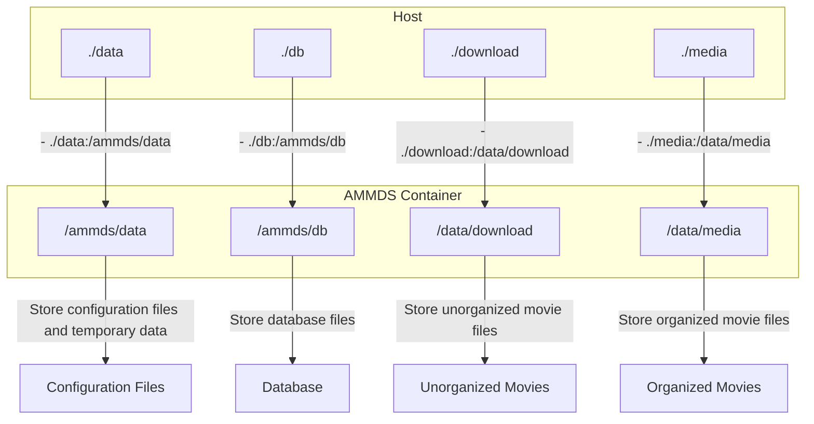
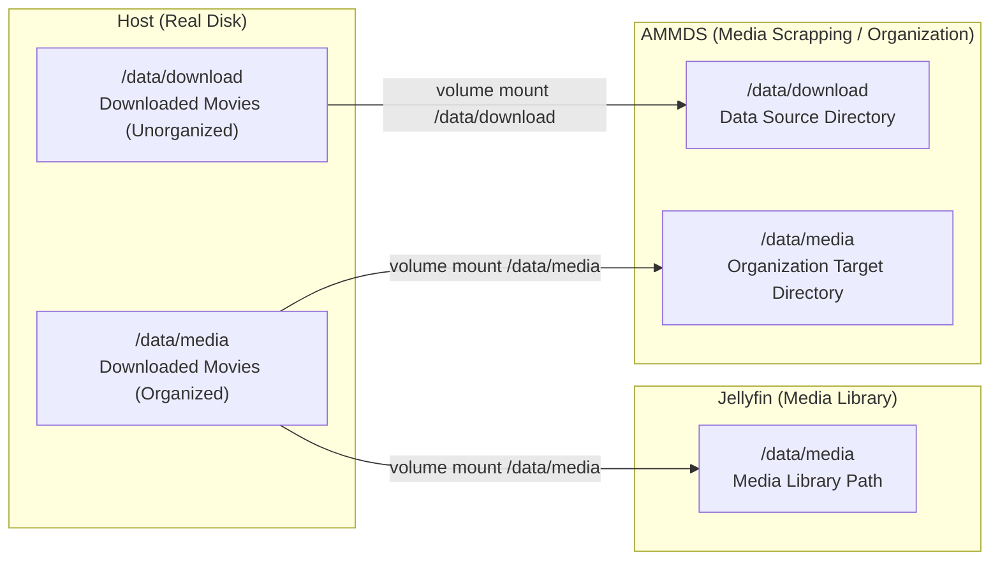
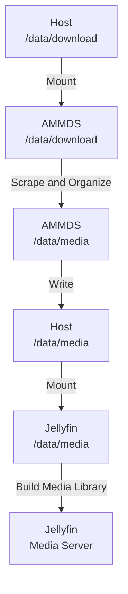
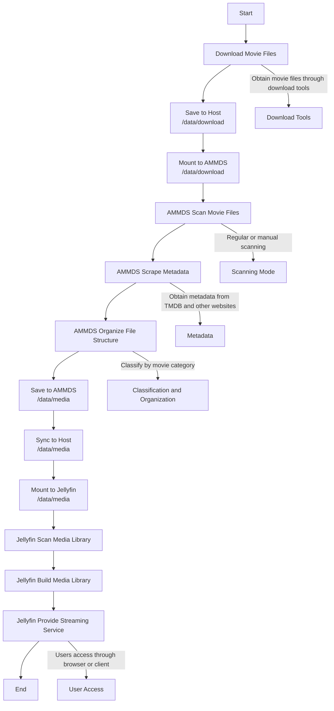
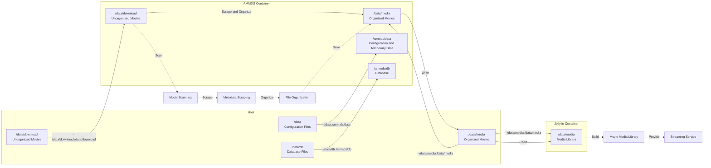

# Mounting Relationships Explained

This document details the mounting relationships related to AMMDS, including mounting logic during deployment and media organization, helping you understand the system's directory structure and data flow.

:::tip
If you're using AMMDS for the first time, we recommend reading this document to understand the system's mounting relationships, which can help avoid data loss or configuration errors during deployment and use.
:::

## I. Mounting Logic During Deployment

### 1. Basic Mounting Configuration

When deploying AMMDS using Docker Compose, you need to configure mount directories in the `docker-compose.yml` file:

```yaml
volumes:
  - ./data:/ammds/data  # Mount the current directory's data folder to the container's /ammds/data
  - ./db:/ammds/db  # Mount the current directory's db folder to the container's /ammds/db
  - ./download:/data/download  # Mount the current directory's download folder to the container's /data/download
  - ./media:/data/media  # Mount the current directory's media folder to the container's /data/media
```

### 2. Directory Explanation

| Host Directory | Container Directory | Purpose |
| ------------- | ------------------ | ------- |
| `./data` | `/ammds/data` | Store AMMDS configuration files and temporary data |
| `./db` | `/ammds/db` | Store AMMDS database files |
| `./download` | `/data/download` | Store downloaded unorganized movie files |
| `./media` | `/data/media` | Store organized movie files for access by media servers like Jellyfin |

### 3. Deployment Mounting Diagram



## II. Media Organization Mounting Logic

### 1. Overall Architecture



### 2. Host and AMMDS Relationship

The host's `/data/download` directory (storing unorganized movie files) is mounted to the AMMDS container's `/data/download` directory via Docker volume. This allows AMMDS to access unorganized movie files on the host for scraping and organization operations.

Specifically:
- The `/data/download` directory on the host corresponds to the `/data/download` directory in the AMMDS container
- AMMDS scans movie files in the `/data/download` directory
- After scraping and organization, AMMDS saves the organized movie files to the `/data/media` directory

:::tip
**Why mount this way?**

- AMMDS needs to access unorganized movie files for scraping and organization, so it needs to mount the `/data/download` directory
- AMMDS needs to save organized movie files to a location accessible by Jellyfin, so it needs to mount the `/data/media` directory
- This mounting method ensures AMMDS and Jellyfin can share the same media library directory, avoiding duplicate data storage
- Using the same path reduces user confusion and makes the system easier to understand and manage
:::

### 3. Host and Jellyfin Relationship

The host's `/data/media` directory (storing organized movie files) is mounted to the Jellyfin container's `/data/media` directory via Docker volume. This allows Jellyfin to access organized movie files to build a media library and provide streaming services.

Specifically:
- The `/data/media` directory on the host corresponds to the `/data/media` directory in the Jellyfin container
- Jellyfin scans movie files in the `/data/media` directory
- Based on the file structure and metadata, Jellyfin builds a media library, providing classification, search, and playback functions

:::tip
**Why does Jellyfin only need to mount the `/data/media` directory?**

- As a media server, Jellyfin only needs to access organized movie files, not unorganized ones
- Organized movie files already contain complete metadata and a standardized file structure that Jellyfin can directly recognize and use
- This mounting method simplifies Jellyfin configuration and improves system security
:::

### 4. AMMDS and Movie Files Relationship

When processing movie files, AMMDS goes through the following流程:

1. **Scanning Phase**: AMMDS scans unorganized movie files in the `/data/download` directory
2. **Scraping Phase**: Based on file names or file content, AMMDS retrieves movie metadata from the internet (such as titles, posters, descriptions, etc.)
3. **Organization Phase**: Based on the scraped metadata, AMMDS renames movie files and organizes them into a directory structure in the `/data/media` directory
4. **Update Phase**: After organization, movie files can be recognized and used by media servers like Jellyfin

### 5. Data Flow



### 6. Media Organization Process Diagram



### 7. Detailed Directory Structure

#### Host Directory Structure

```
/data/
├── download/           # Unorganized movie files
│   ├── movie1.mp4      # Movie files
│   └── ...
└── media/              # Organized movie files
    ├── Movies/         # Movie directory
    │   ├── Movie 1 (2023)/
    │   │   ├── Movie 1 (2023).mp4
    │   │   └── poster.jpg
    │   └── ...
    └── ...
```

#### AMMDS Container Directory Structure

```
/ammds/
├── data/               # Mapped from host's /data
│   ├── config.json     # Configuration files
│   └── ...
├── db/                 # Mapped from host's /data/db
│   ├── ammds.db        # Database files
│   └── ...
├── download/           # Mapped from host's /data/download
│   ├── movie1.mp4
│   └── ...
/media/                  # Mapped from host's /data/media
├── Movies/
└── ...
```

#### Jellyfin Container Directory Structure

```
/data/
└── media/              # Mapped from host's /data/media
    ├── Movies/
    └── ...
```

## III. Complete Mounting Relationship Diagram



## IV. FAQ

### 1. What to do if mounting fails?

- **Check if the path is correct**: Ensure the host directory exists and the path format is correct
- **Check if permissions are sufficient**: Ensure the host directory has read and write permissions
- **Check if Docker service is running**: Ensure the Docker service is running normally
- **Check if mounting syntax is correct**: Ensure the mounting syntax in docker-compose.yml is correct, in the format `- host path:container path`

### 2. What to do if organized movie files are not visible in Jellyfin?

- **Check if mounting is correct**: Ensure the Jellyfin container correctly mounts the `/data/media` directory
- **Check media library configuration**: Ensure the correct media library path is added in Jellyfin
- **Manually scan media library**: Manually scan the media library in Jellyfin to update the media library content
- **Check file permissions**: Ensure movie files have read permissions

### 3. What to do if the size of organized movie files changes?

- **Check if compression is enabled**: AMMDS does not compress movie files by default; check if other tools are compressing files
- **Check file format**: Ensure the file format is not changed during the organization process
- **Check metadata size**: Metadata files (such as nfo files, posters, etc.) are added during the organization process, which increases the total size

### 4. How to back up mounted directories?

- **Regular backup**: Regularly back up the `/data/download` and `/data/media` directories on the host
- **Backup database**: Also back up the `/data/db` directory to save AMMDS configuration and scraping records
- **Test backup**: Regularly test if backups can be restored normally

:::warning
**Important Reminder**

- Do not directly modify the permissions of mounted directories while containers are running, as this may cause containers to be unable to access them normally
- Regularly clean up unorganized movie files to avoid occupying too much storage space
- Ensure the host has sufficient storage space to avoid organization failure due to insufficient space
:::