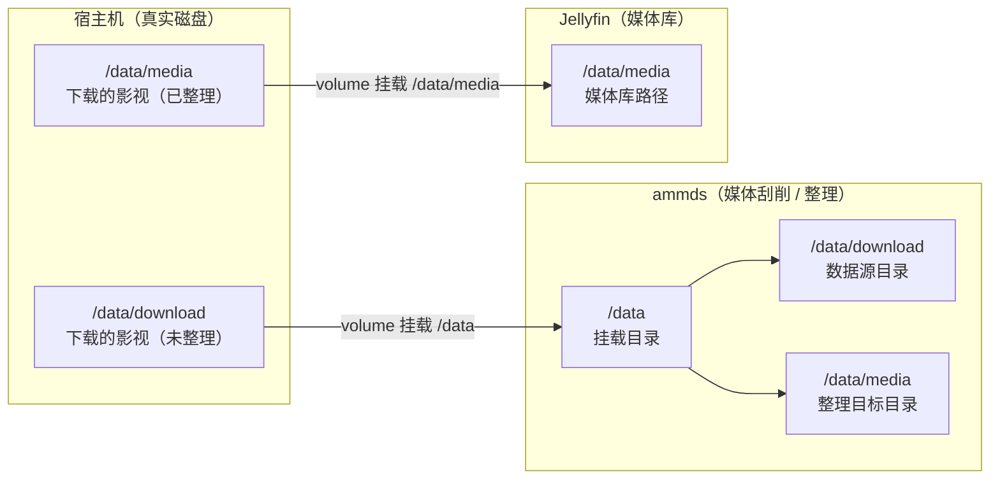

```mermaid
flowchart LR
    %% =========================
    %% 宿主机（只保留事实）
    %% =========================
    subgraph HOST["宿主机（真实磁盘）"]
        D1["/data/download<br/>下载的影视（未整理）"]
        D2["/data/media<br/>下载的影视（已整理）"]
    end

    %% =========================
    %% ammds
    %% =========================
    subgraph AMMDS["ammds（媒体刮削 / 整理）"]
        A["/data<br/>挂载目录"]
        A1["/data/download<br/>数据源目录"]
        A2["/data/media<br/>整理目标目录"]
        A --> A1
        A --> A2
    end

    %% =========================
    %% jellyfin
    %% =========================
    subgraph JELLYFIN["Jellyfin（媒体库）"]
        J["/data/media<br/>媒体库路径"]
    end

    %% =========================
    %% 挂载关系（只剩必要的）
    %% =========================
    D1 -->|"volume 挂载 /data"| A
    D2 -->|"volume 挂载 /data/media"| J

```