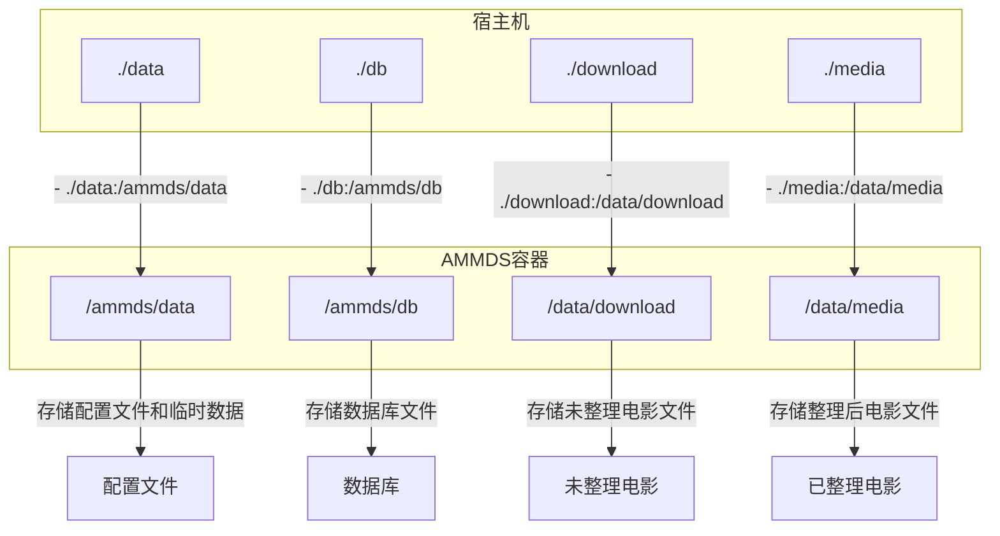
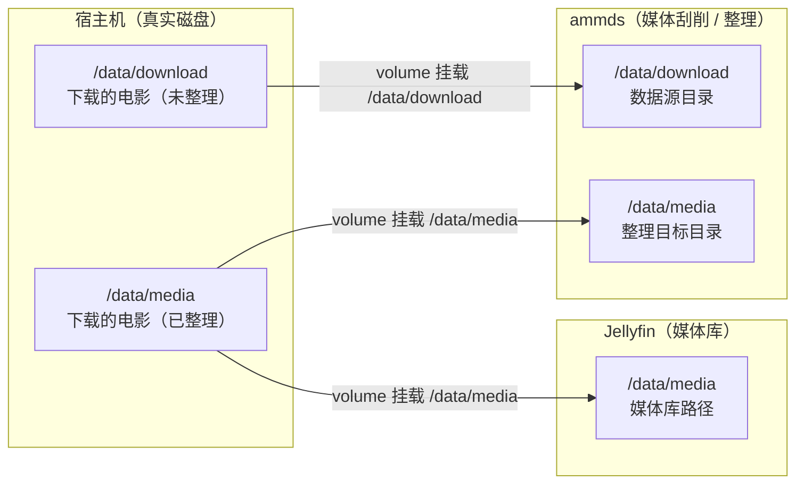
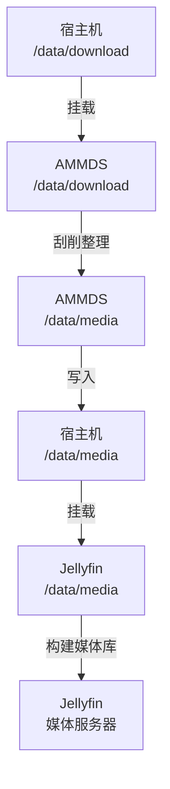
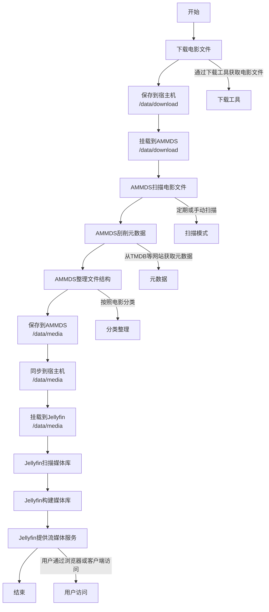
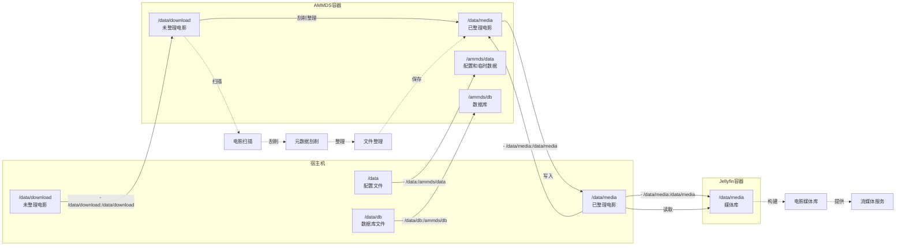

# 挂载关系详解

本文用大白话讲清楚 AMMDS 的挂载关系——也就是各个文件夹之间怎么连起来的，数据怎么在它们之间流转。

:::tip
如果你是第一次用 AMMDS，建议先看这篇，搞清楚挂载是怎么回事，后面部署和使用就不会搞丢数据或配错配置了。
:::

## 一、部署时的挂载逻辑

### 1. 基本挂载配置

用 Docker Compose 部署 AMMDS 时，需要在 `docker-compose.yml` 文件里配置挂载目录：

> **啥是"挂载"？** 挂载就是把宿主机（你的电脑/服务器）上的一个文件夹，映射到 Docker 容器（一个独立的"小盒子"）里，让"小盒子"能读写这个文件夹。就像把 U 盘插到电脑上，电脑就能访问 U 盘里的文件一样。

```yaml
volumes:
  - ./data:/ammds/data  # 挂载当前目录的 data 文件夹到容器的 /ammds/data
  - ./db:/ammds/db  # 挂载当前目录的 db 文件夹到容器的 /ammds/db
  - ./download:/data/download  # 挂载当前目录的 download 文件夹到容器的 /data/download
  - ./media:/data/media  # 挂载当前目录的 media 文件夹到容器的 /data/media
```

### 2. 目录说明

| 宿主机目录（你的电脑） | 容器目录（"小盒子"里） | 干啥用的 |
| ---------- | -------- | ---- |
| `./data` | `/ammds/data` | 放 AMMDS 的配置文件和临时数据 |
| `./db` | `/ammds/db` | 放 AMMDS 的数据库文件 |
| `./download` | `/data/download` | 放下载好的、还没整理的电影文件 |
| `./media` | `/data/media` | 放整理好的电影文件，给 Jellyfin 这类媒体服务器用 |

### 3. 部署挂载示意图


```mermaid
flowchart TD
    %% 宿主机目录
    subgraph HOST["宿主机"]
        H_DATA["./data"]
        H_DB["./db"]
        H_DOWNLOAD["./download"]
        H_MEDIA["./media"]
    end

    %% AMMDS容器
    subgraph AMMDS["AMMDS容器"]
        A_DATA["/ammds/data"]
        A_DB["/ammds/db"]
        A_DOWNLOAD["/data/download"]
        A_MEDIA["/data/media"]
    end

    %% 挂载关系
    H_DATA -->|"- ./data:/ammds/data"| A_DATA
    H_DB -->|"- ./db:/ammds/db"| A_DB
    H_DOWNLOAD -->|"- ./download:/data/download"| A_DOWNLOAD
    H_MEDIA -->|"- ./media:/data/media"| A_MEDIA

    %% 说明
    A_DATA -->|"存储配置文件和临时数据"| CONFIG["配置文件"]
    A_DB -->|"存储数据库文件"| DATABASE["数据库"]
    A_DOWNLOAD -->|"存储未整理电影文件"| RAW_MEDIA["未整理电影"]
    A_MEDIA -->|"存储整理后电影文件"| PROCESSED_MEDIA["已整理电影"]
```

## 二、媒体整理的挂载逻辑

### 1. 整体架构


```mermaid
flowchart LR
    %% =========================
    %% 宿主机（只保留事实）
    %% =========================
    subgraph HOST["宿主机（真实磁盘）"]
        D1["/data/download<br/>下载的电影（未整理）"]
        D2["/data/media<br/>下载的电影（已整理）"]
    end

    %% =========================
    %% ammds
    %% =========================
    subgraph AMMDS["ammds（媒体刮削 / 整理）"]
        A1["/data/download<br/>数据源目录"]
        A2["/data/media<br/>整理目标目录"]
    end

    %% =========================
    %% jellyfin
    %% =========================
    subgraph JELLYFIN["Jellyfin（媒体库）"]
        J["/data/media<br/>媒体库路径"]
    end

    %% =========================
    %% 挂载关系（只剩必要的）
    %% =========================
    D1 -->|"volume 挂载 /data/download"| A1
    D2 -->|"volume 挂载 /data/media"| A2
    D2 -->|"volume 挂载 /data/media"| J

```

### 2. 宿主机跟 AMMDS 的关系

宿主机上的 `/data/download`（放未整理电影）通过 Docker 挂载功能，映射到 AMMDS 容器里的 `/data/download`。这样一来，AMMDS 就能看到宿主机上还没整理的那些电影文件，然后对它们进行刮削和整理。

简单说就是：
- 你电脑上的 `/data/download` ↔ AMMDS 里看到的 `/data/download`（是同一个地方）
- AMMDS 扫描 `/data/download` 里的电影文件
- 刮削整理完后，AMMDS 把整理好的电影存到 `/data/media`

:::tip
**为啥要这么挂？**

- AMMDS 得能读到没整理过的电影，才能进行刮削和整理，所以要挂载 `/data/download`
- AMMDS 整理好的电影得放到 Jellyfin 也能看到的地方，所以要挂载 `/data/media`
- 这样 AMMDS 和 Jellyfin 就能共用同一个媒体文件夹，不需要把电影复制两份
- 路径保持一致，你管理起来也更清爽
:::

### 3. 宿主机跟 Jellyfin 的关系

宿主机上的 `/data/media`（放已整理电影）通过 Docker 挂载功能，映射到 Jellyfin 容器里的 `/data/media`。这样 Jellyfin 就能读到整理好的电影，用来搭建媒体库，给你提供在线看片服务。

简单说就是：
- 你电脑上的 `/data/media` ↔ Jellyfin 里看到的 `/data/media`（是同一个地方）
- Jellyfin 扫描 `/data/media` 里的电影
- 根据文件结构和元数据（电影信息），Jellyfin 建好媒体库，让你能分类、搜索和播放

:::tip
**为什么 Jellyfin 只需要挂 `/data/media`？**

- Jellyfin 只是个播放器/媒体服务器，只看整理好的成品，不需要管没整理的原始文件
- 整理好的电影已经有完整的信息和规整的文件结构，Jellyfin 拿来就能用
- 这样 Jellyfin 的配置更简单，也更安全
:::

### 4. AMMDS 跟电影文件的关系

AMMDS 处理电影文件时，走的是这么一套流程：

1. **扫描阶段**：AMMDS 到 `/data/download` 里找没整理过的电影文件
2. **刮削阶段**：根据文件名或文件内容，从网上自动抓取电影的信息（比如标题、海报、简介等，这些信息统称"元数据"）
3. **整理阶段**：根据抓到的信息，把电影文件改个规范的名字，按一定目录结构放到 `/data/media`
4. **更新阶段**：整理好后，Jellyfin 这类媒体服务器就能识别和使用了

### 5. 数据流向


```mermaid
flowchart TD
    %% 数据流向图
    HOST_DOWNLOAD["宿主机<br/>/data/download"] -->|"挂载"| AMMDS_DOWNLOAD["AMMDS<br/>/data/download"]
    AMMDS_DOWNLOAD -->|"刮削整理"| AMMDS_MEDIA["AMMDS<br/>/data/media"]
    AMMDS_MEDIA -->|"写入"| HOST_MEDIA["宿主机<br/>/data/media"]
    HOST_MEDIA -->|"挂载"| JELLYFIN_MEDIA["Jellyfin<br/>/data/media"]
    JELLYFIN_MEDIA -->|"构建媒体库"| JELLYFIN_SERVER["Jellyfin<br/>媒体服务器"]
```

### 6. 媒体整理流程示意图


```mermaid
flowchart TD
    %% 开始
    START["开始"] --> DOWNLOAD["下载电影文件"]
    
    %% 下载阶段
    DOWNLOAD --> SAVE_RAW["保存到宿主机<br/>/data/download"]
    
    %% AMMDS处理阶段
    SAVE_RAW --> MOUNT_TO_AMMDS["挂载到AMMDS<br/>/data/download"]
    MOUNT_TO_AMMDS --> SCAN["AMMDS扫描电影文件"]
    SCAN --> SCRAPE["AMMDS刮削元数据"]
    SCRAPE --> ORGANIZE["AMMDS整理文件结构"]
    ORGANIZE --> SAVE_PROCESSED["保存到AMMDS<br/>/data/media"]
    
    %% 宿主机同步阶段
    SAVE_PROCESSED --> SYNC_TO_HOST["同步到宿主机<br/>/data/media"]
    
    %% Jellyfin处理阶段
    SYNC_TO_HOST --> MOUNT_TO_JELLYFIN["挂载到Jellyfin<br/>/data/media"]
    MOUNT_TO_JELLYFIN --> JELLYFIN_SCAN["Jellyfin扫描媒体库"]
    JELLYFIN_SCAN --> BUILD_LIBRARY["Jellyfin构建媒体库"]
    BUILD_LIBRARY --> PROVIDE_STREAM["Jellyfin提供流媒体服务"]
    
    %% 结束
    PROVIDE_STREAM --> END["结束"]
    
    %% 流程说明
    DOWNLOAD -->|"通过下载工具获取电影文件"| DOWNLOAD_TOOL["下载工具"]
    SCAN -->|"定期或手动扫描"| SCAN_MODE["扫描模式"]
    SCRAPE -->|"从TMDB等网站获取元数据"| METADATA["元数据"]
    ORGANIZE -->|"按照电影分类"| CATEGORIZE["分类整理"]
    PROVIDE_STREAM -->|"用户通过浏览器或客户端访问"| USER_ACCESS["用户访问"]
```

### 7. 详细目录结构

#### 宿主机目录结构

```
/data/
├── download/           # 没整理过的电影文件
│   ├── movie1.mp4      # 电影文件
│   └── ...
└── media/              # 已整理好的电影文件
    ├── Movies/         # 电影目录
    │   ├── Movie 1 (2023)/
    │   │   ├── Movie 1 (2023).mp4
    │   │   └── poster.jpg
    │   └── ...
    └── ...
```

#### AMMDS 容器目录结构

```
/ammds/
├── data/               # 映射自宿主机的 /data
│   ├── config.json     # 配置文件
│   └── ...
├── db/                 # 映射自宿主机的 /data/db
│   ├── ammds.db        # 数据库文件
│   └── ...
├── download/           # 映射自宿主机的 /data/download
│   ├── movie1.mp4
│   └── ...
/media/                  # 映射自宿主机的 /data/media
├── Movies/
└── ...
```

#### Jellyfin 容器目录结构

```
/data/
└── media/              # 映射自宿主机的 /data/media
    ├── Movies/
    └── ...
```

## 三、完整挂载关系示意图


```mermaid
flowchart LR
    %% =========================
    %% 宿主机
    %% =========================
    subgraph HOST["宿主机"]
        H_DOWNLOAD["/data/download<br/>未整理电影"]
        H_MEDIA["/data/media<br/>已整理电影"]
        H_CONFIG["/data<br/>配置文件"]
        H_DB["/data/db<br/>数据库文件"]
    end

    %% =========================
    %% AMMDS
    %% =========================
    subgraph AMMDS["AMMDS容器"]
        A_DATA["/ammds/data<br/>配置和临时数据"]
        A_DB["/ammds/db<br/>数据库"]
        A_DOWNLOAD["/data/download<br/>未整理电影"]
        A_MEDIA["/data/media<br/>已整理电影"]
    end

    %% =========================
    %% Jellyfin
    %% =========================
    subgraph JELLYFIN["Jellyfin容器"]
        J_MEDIA["/data/media<br/>媒体库"]
    end

    %% =========================
    %% 挂载关系
    %% =========================
    H_DOWNLOAD -->|"- /data/download:/data/download"| A_DOWNLOAD
    H_MEDIA -->|"- /data/media:/data/media"| A_MEDIA
    H_CONFIG -->|"- /data:/ammds/data"| A_DATA
    H_DB -->|"- /data/db:/ammds/db"| A_DB
    H_MEDIA -->|"- /data/media:/data/media"| J_MEDIA

    %% =========================
    %% 数据流向
    %% =========================
    A_DOWNLOAD -->|"刮削整理"| A_MEDIA
    A_MEDIA -->|"写入"| H_MEDIA
    H_MEDIA -->|"读取"| J_MEDIA

    %% =========================
    %% 功能说明
    %% =========================
    A_DOWNLOAD -.->|"扫描"| SCAN["电影扫描"]
    SCAN -.->|"刮削"| SCRAPE["元数据刮削"]
    SCRAPE -.->|"整理"| ORGANIZE["文件整理"]
    ORGANIZE -.->|"保存"| A_MEDIA
    J_MEDIA -.->|"构建"| LIBRARY["电影媒体库"]
    LIBRARY -.->|"提供"| STREAM["流媒体服务"]
```

## 四、常见问题解答

### 1. 挂载失败怎么办？

- **检查路径对不对**：确认宿主机上的那个文件夹存在，路径写对了
- **检查权限够不够**：确认宿主机上的文件夹有读写权限
- **检查 Docker 有没有在跑**：确认 Docker 服务正常运行
- **检查挂载语法对不对**：确认 `docker-compose.yml` 里的挂载写法正确，格式是 `- 宿主机路径:容器路径`

### 2. 电影整理完后在 Jellyfin 里看不到怎么办？

- **检查挂载对不对**：确认 Jellyfin 容器正确挂载了 `/data/media`
- **检查媒体库配置**：确认 Jellyfin 里加了正确的媒体库路径
- **手动扫一下媒体库**：在 Jellyfin 里手动扫描，刷新内容
- **检查文件权限**：确认电影文件有可读权限

### 3. 整理后的电影文件大小变了怎么办？

- **看看是不是开了压缩**：AMMDS 默认不会压缩电影文件，检查是不是有其他工具在压缩
- **检查文件格式**：确认整理过程中文件格式没变
- **元数据文件也会占地方**：整理时会额外生成信息文件（比如 nfo 文件、海报图等），总大小会变大一些

### 4. 怎么备份挂载的目录？

- **定期备份**：定期备份宿主机上的 `/data/download` 和 `/data/media`
- **也要备份数据库**：同时备份 `/data/db`，保存 AMMDS 的配置和刮削记录
- **测试备份能否恢复**：定期检查备份能不能正常恢复

:::warning
**重要提醒**

- 容器运行的时候，别直接去改挂载目录的权限，可能导致容器没法正常访问
- 定期清理没整理的电影文件，免得占太多硬盘空间
- 确保宿主机有足够的硬盘空间，免得整理到一半空间不够了
:::
