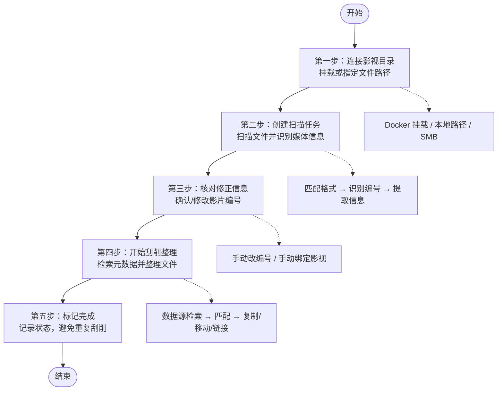
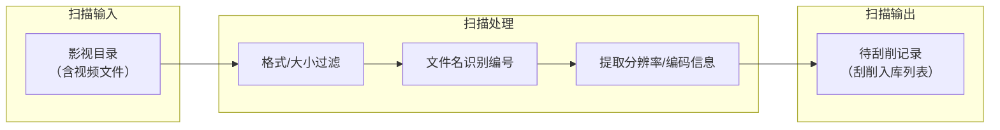
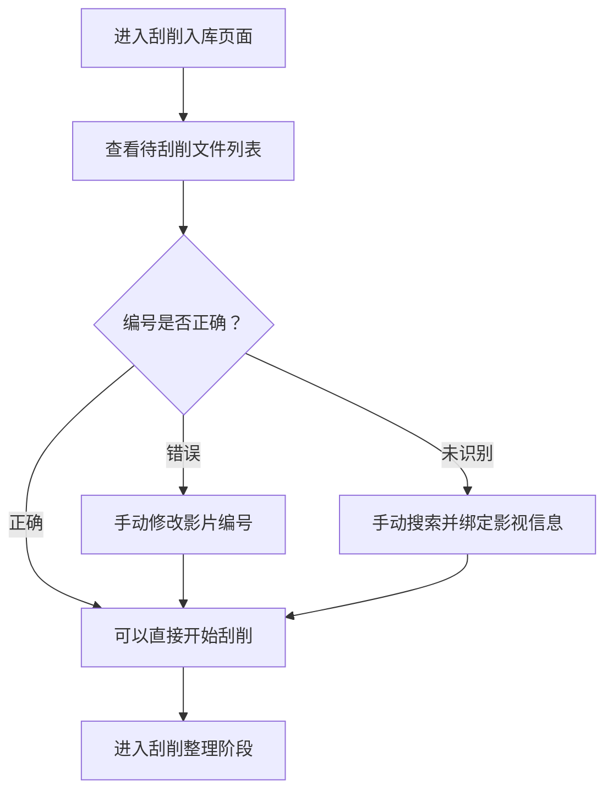
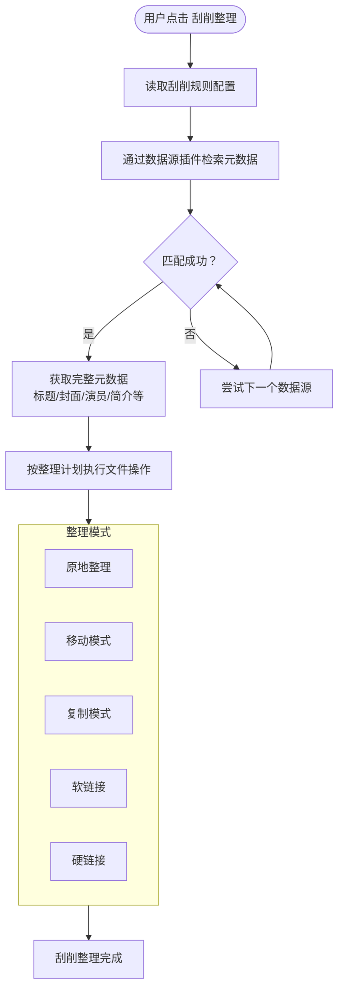
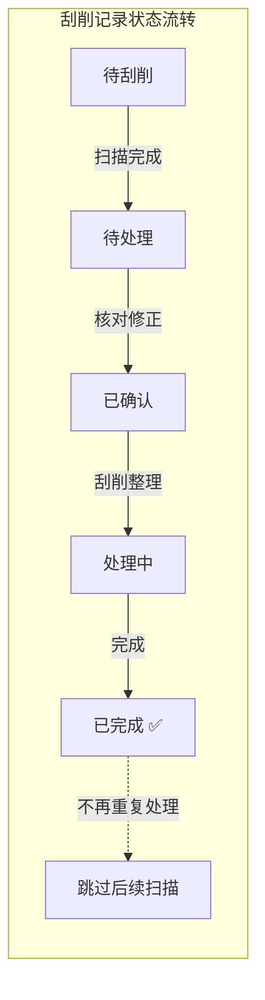

# 刮削流程详解

本文详细讲解 AMMDS 的整套刮削流程，从挂载影视目录到扫描文件、识别影片编号、刮削元数据和整理文件。

{/* truncate */}

本文用大白话给你讲清楚 AMMDS 的整套刮削流程——从你挂载好影视目录开始，到扫描文件、识别影片编号、刮削元数据、整理文件，一步不落。

> **"刮削"是啥意思？** 刮削就是让系统自动去网上搜刮电影的信息（封面图、简介、演员表、评分这些，统称"元数据"），然后下载下来跟你的视频文件配对。就像给电影文件"贴标签"一样。

## 一、整体流程一览

AMMDS 的整个刮削流程可以概括为五个步骤：

下面咱们一步步拆开看，每一步具体是怎么操作的。

---

## 二、第一步：连接影视目录

这是整个流程的起点。你得让 AMMDS 能读到你的影视文件，它才能开始干活。

### 三种连接方式

AMMDS 通过以下三种方式访问你的影视目录：

| 方式 | 说明 | 适用场景 |
|------|------|----------|
| **Docker 挂载** | 部署时通过 `volumes` 把宿主机目录映射到容器内 | 最常用，Docker 部署 |
| **本地文件路径** | 二进制直接运行，读取本机文件系统路径 | 二进制部署 |
| **远程挂载** | 通过 SMB、NFS 等协议挂载远程存储 | NAS 远程目录 |

### 用大白话理解

简单说就是：不管你是用 Docker 还是直接跑程序，都得让 AMMDS 知道你放电影的文件路径在哪。

- **Docker 用户**：在 `docker-compose.yml` 里配好目录映射（具体怎么配，看[挂载关系详解](/docs/usage/Mount)）
- **二进制用户**：直接在配置里填你电脑上的文件夹路径
- **NAS 用户**：先用 SMB 或 NFS 把远程目录挂载到本地，再告诉 AMMDS

路径配好后，AMMDS 就能找到你的电影文件了。

:::tip
如果你是 Docker 新手，建议先看[挂载关系详解](/docs/usage/Mount)，搞明白挂载是怎么回事，后面才不会搞丢数据。
:::

---

## 三、第二步：扫描影视文件

目录连上之后，就该让 AMMDS 去翻翻里面都有哪些电影了。

### 1. 创建扫描任务

在 AMMDS 里创建一个扫描任务，告诉它：
- **扫哪个文件夹**：你放电影的目录
- **怎么扫**：按什么规则匹配文件（格式、大小、忽略项等）
- **怎么整理**：扫完后文件放哪、怎么改名

具体操作步骤看[创建扫描任务](/docs/usage/scrape/ScanTask)。

### 2. 扫描做了什么

扫描任务运行时，系统会做下面这些事：

1. **遍历文件**：把指定目录和子目录翻个底朝天
2. **过滤筛选**：按扫描配置过滤——不认识的格式不要、太小的文件不要、忽略目录里的不要
3. **识别编号**：从文件名里"抠"出影片编号（行话叫"车牌号"，比如 `ABC-123`）
4. **提取信息**：看看视频的分辨率（1080p、4K）、编码格式等信息
5. **生成记录**：把识别到的影视信息存到数据库，形成待刮削记录

### 3. 扫描结果

扫描完成后，在 **任务管理 >> 刮削入库** 页面就能看到所有待刮削的文件，每条记录都包含：
- 文件名
- 自动识别的影片编号（车牌号）
- 文件大小和分辨率等基本信息

扫描配置的详细说明，看[扫描配置](/docs/usage/module/scanRuleConfig)。

---

## 四、第三步：核对与修正信息

扫描结束后，系统自动识别了影片编号，但有时候可能识别得不太准。这一步就是让你手动检查和修正的。

### 1. 查看扫描结果

进入 **任务管理 >> 刮削入库**，你能看到所有待刮削的文件列表。每条记录都有一个自动识别出来的影片编号（车牌号）。

### 2. 修正影片编号

如果自动识别的编号错了（比如文件名太乱导致认错了），你可以：
- **直接修改**：点进记录，把车牌号改成正确的（比如把 `ABC-123` 改成 `XYZ-456`）
- **重新识别**：让系统用新编号重新匹配

### 3. 手动绑定影视信息

如果你发现系统没自动识别出来，或者想自己指定影片信息，也可以：
- **手动搜索**：手动输入关键字搜索影视信息
- **手动绑定**：直接从搜索结果里选一个绑定到文件上

### 4. 批量操作

文件多了可以批量勾选，一起修正或绑定，不用一个一个地改。

详细操作参考[执行刮削任务](/docs/usage/scrape/ScrapeTask)。

---

## 五、第四步：刮削与整理

编号确认没问题了，接下来就是重头戏——刮削和整理。

### 1. 开始刮削

在刮削入库页面，勾选你要处理的文件，点击 **刮削整理** 按钮，系统就开始干活了。

### 2. 刮削做了什么

刮削时，系统按顺序干这几件事：

**① 检索元数据**

系统通过你配置的数据源插件去搜索影片的详细信息。可用的数据源插件有：
- [Metatube](/docs/plugin/metadata/Metatube)
- [ThePornDB](/docs/plugin/metadata/ThePornDB)
- [FanzaDMM](/docs/plugin/metadata/FanzaDmm)
- [Madou](/docs/plugin/metadata/Madou)
- 本地数据

**② 数据匹配**

插件找到的信息会和你的视频文件进行匹配，匹配成功后获取完整的元数据：
- 影片标题、简介、评分
- 封面海报、剧照
- 演员表、导演、制作商
- 发行日期、标签分类

**③ 整理文件**

元数据到手后，按照你配置的**整理计划**执行文件操作。支持的整理模式有：

| 整理模式 | 干啥的 | 适合场景 |
|---------|-------|---------|
| **原地整理** | 文件不动，只改名加信息 | 不想移动文件 |
| **移动模式** | 把文件移到目标目录 | 集中管理文件 |
| **复制模式** | 复制一份到目标目录 | 保留原始文件 |
| **软链接** | 在目标目录创建"快捷方式" | 不占额外空间 |
| **硬链接** | 在目标目录创建文件"分身" | 同分区多入口访问 |

### 3. 刮削流程图

:::warning
没开启元数据插件就拿不到电影信息，刮削必然会失败。刮削之前确认一下插件配好了没有。
:::

刮削配置和整理模式的详细说明，看[刮削配置](/docs/usage/module/scrapeRuleConfig)。

---

## 六、第五步：标记完成

### 1. 自动标记

刮削整理完成后，系统会自动做两件事：

1. **标记记录完成**：这条记录的扫描状态变成"已完成"
2. **写入数据库**：把刮削结果和整理后的文件路径存到数据库

标记完成后，这条记录就不会再出现在待刮削列表里了，避免了重复刮削同一部电影。

### 2. 状态图解

### 3. 后续操作

整理好的文件会按你配置的目录格式存放，之后可以用 [Jellyfin](/docs/plugin/mediaServer/Jellyfin) 或 [Emby](/docs/plugin/mediaServer/Emby) 这类媒体服务器来搭建影视库，在线观看。

---

## 常见问题

### Q: 为什么扫描时有些文件没识别出来？

可能是这些原因：
- 文件格式不在扫描配置的允许列表里
- 文件大小为 0 或太小（低于最小视频大小门槛）
- 文件名里包含被忽略的关键词
- 文件在设置为"忽略目录"的文件夹里

### Q: 刮削失败怎么办？

先检查这几样：
1. 网络能正常访问互联网吗？
2. 元数据插件开着吗？配好了吗？
3. 影片编号对吗？要不要手动改一下试试？
4. 看系统日志，有详细错误信息

### Q: 刮削完了能在哪看？

整理好的文件放在你配置的目标目录里。你可以用 Jellyfin、Emby、Plex 等媒体服务器挂载这个目录，就能在线看了。

### Q: 软链接和硬链接有啥区别？

- **软链接**：相当于 Windows 的快捷方式——不占空间，但原文件删了它就废了
- **硬链接**：相当于文件的"分身"——占空间（但指向同一份存储数据），原文件删了它还能用，不过只能在同一个硬盘分区里创建

### Q: 怎么避免重复刮削？

系统默认不会重复刮削已完成的记录。每次扫描时，系统会检查数据库，已经处理过的文件会自动跳过。
