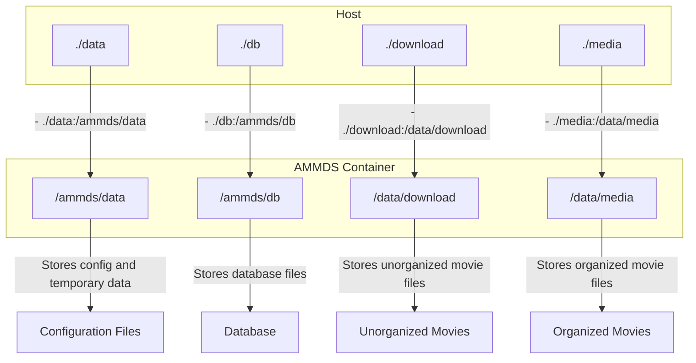
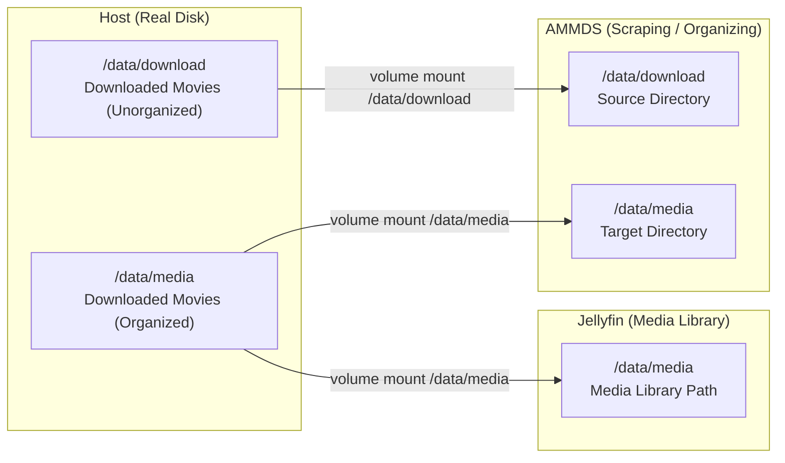
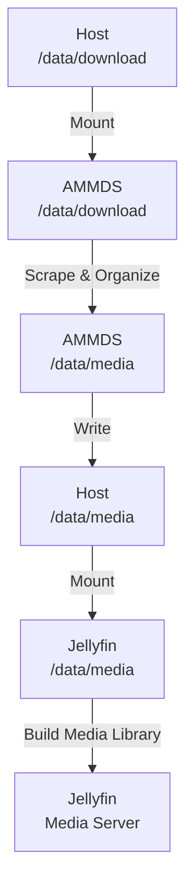
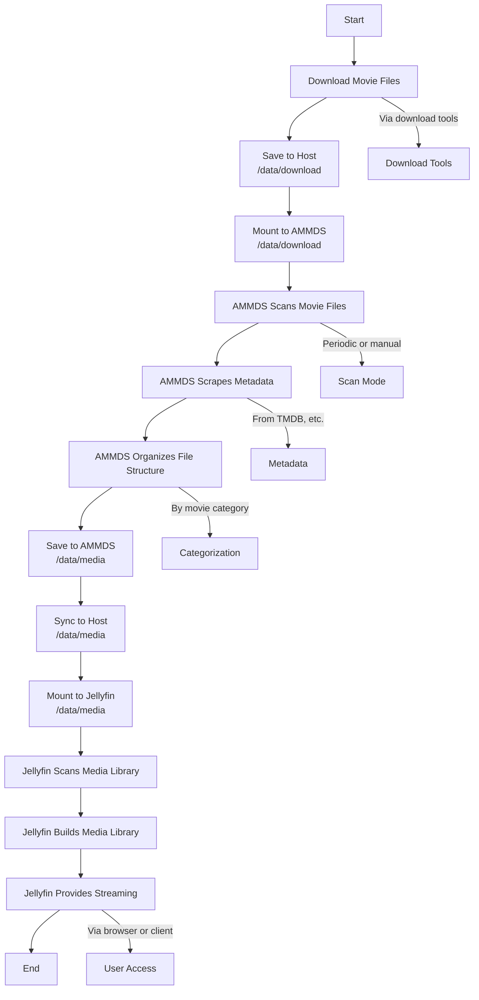
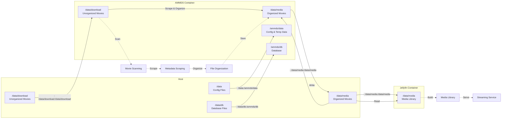

# Mounting Relationships Explained

This article explains AMMDS's mounting relationships in plain English — how folders are connected and how data flows between them.

:::tip
If you're new to AMMDS, start with this article to understand how mounting works. It'll help you avoid data loss or misconfiguration during deployment and daily use.
:::

## I. Mounting Logic During Deployment

### 1. Basic Mounting Configuration

When deploying AMMDS with Docker Compose, you need to configure mount directories in the `docker-compose.yml`:

> **What is "mounting"?** Mounting maps a folder on your host machine (your computer/server) into a Docker container (an isolated "little box"), so the container can read and write to that folder. Think of it like plugging a USB drive into your computer — the computer can then access files on the drive.

```yaml
volumes:
  - ./data:/ammds/data  # Mount ./data to the container's /ammds/data
  - ./db:/ammds/db  # Mount ./db to the container's /ammds/db
  - ./download:/data/download  # Mount ./download to the container's /data/download
  - ./media:/data/media  # Mount ./media to the container's /data/media
```

### 2. Directory Explanation

| Host Directory | Container Directory | What It's For |
| -------------- | ------------------ | ------------- |
| `./data` | `/ammds/data` | Stores AMMDS config files and temporary data |
| `./db` | `/ammds/db` | Stores AMMDS database files |
| `./download` | `/data/download` | Stores downloaded, unorganized movie files |
| `./media` | `/data/media` | Stores organized movie files for media servers like Jellyfin |

### 3. Deployment Mounting Diagram



## II. Media Organization Mounting Logic

### 1. Overall Architecture



### 2. Host and AMMDS Relationship

The host's `/data/download` (where unorganized movies live) is mounted to the AMMDS container's `/data/download` via Docker volumes. This lets AMMDS see those unorganized movie files and scrape/organize them.

Simply put:
- Your computer's `/data/download` ↔ AMMDS's `/data/download` (same place)
- AMMDS scans movie files in `/data/download`
- After scraping and organizing, AMMDS saves the organized files to `/data/media`

:::tip
**Why mount things this way?**

- AMMDS needs to read unorganized movies to scrape and organize them, so it needs `/data/download`
- AMMDS needs to put organized movies somewhere Jellyfin can see them, so it needs `/data/media`
- This way AMMDS and Jellyfin share the same media folder — no need to duplicate files
- Consistent paths make management cleaner for you
:::

### 3. Host and Jellyfin Relationship

The host's `/data/media` (where organized movies live) is mounted to the Jellyfin container's `/data/media` via Docker volumes. This lets Jellyfin read the organized movies and build a media library for streaming.

Simply put:
- Your computer's `/data/media` ↔ Jellyfin's `/data/media` (same place)
- Jellyfin scans `/data/media` for movies
- Based on file structure and metadata (movie info), Jellyfin builds a media library so you can browse, search, and play

:::tip
**Why does Jellyfin only need `/data/media`?**

- Jellyfin is just a player/media server — it only looks at the finished, organized files
- Organized movies already have complete info and clean file structure, ready for Jellyfin to use
- This keeps Jellyfin's configuration simpler and more secure
:::

### 4. AMMDS and Movie Files Relationship

Here's how AMMDS processes movie files:

1. **Scanning Phase**: AMMDS looks for unorganized movie files in `/data/download`
2. **Scraping Phase**: Based on file names or content, it automatically fetches movie info from the internet (title, poster, description, etc. — collectively called "metadata")
3. **Organization Phase**: Based on the fetched info, it renames the movie file and places it in a standard directory structure under `/data/media`
4. **Update Phase**: After organization, media servers like Jellyfin can recognize and use the files

### 5. Data Flow



### 6. Media Organization Process Diagram



### 7. Detailed Directory Structure

#### Host Directory Structure

```
/data/
├── download/           # Unorganized movie files
│   ├── movie1.mp4
│   └── ...
└── media/              # Organized movie files
    ├── Movies/
    │   ├── Movie 1 (2023)/
    │   │   ├── Movie 1 (2023).mp4
    │   │   └── poster.jpg
    │   └── ...
    └── ...
```

#### AMMDS Container Directory Structure

```
/ammds/
├── data/               # Mapped from host's ./data
│   ├── config.json
│   └── ...
├── db/                 # Mapped from host's ./db
│   ├── ammds.db
│   └── ...
├── download/           # Mapped from host's ./download
│   ├── movie1.mp4
│   └── ...
/media/                  # Mapped from host's ./media
├── Movies/
└── ...
```

#### Jellyfin Container Directory Structure

```
/data/
└── media/              # Mapped from host's ./media
    ├── Movies/
    └── ...
```

## III. Complete Mounting Relationship Diagram



## IV. FAQ

### 1. What if mounting fails?

- **Check the path**: Make sure the host folder exists and the path is correct
- **Check permissions**: Make sure the host folder has read/write permissions
- **Check Docker**: Make sure Docker is running properly
- **Check syntax**: Make sure the mount syntax in `docker-compose.yml` is correct — format is `- host_path:container_path`

### 2. What if organized movies don't show up in Jellyfin?

- **Check Jellyfin's mount**: Make sure the Jellyfin container has `/data/media` mounted correctly
- **Check media library config**: Make sure Jellyfin has the right media library path configured
- **Scan manually in Jellyfin**: Run a manual scan in Jellyfin to refresh the library
- **Check file permissions**: Make sure the movie files are readable

### 3. What if organized movie file sizes change?

- **Check if compression is on**: AMMDS doesn't compress files by default — check if some other tool is doing it
- **Check file format**: Make sure the file format hasn't changed during processing
- **Metadata takes space**: Extra info files (nfo files, posters, etc.) are generated during organization, so total size will increase a bit

### 4. How to back up mounted directories?

- **Back up regularly**: Regularly back up the host's `/data/download` and `/data/media`
- **Back up the database too**: Also back up `/data/db` to preserve AMMDS config and scraping records
- **Test your backups**: Periodically check that backups can be restored

:::warning
**Important Reminder**

- Don't modify mount directory permissions while containers are running — it may cause access issues
- Regularly clean up unorganized movie files to save disk space
- Make sure the host has enough free space to avoid organization failures mid-process
:::
