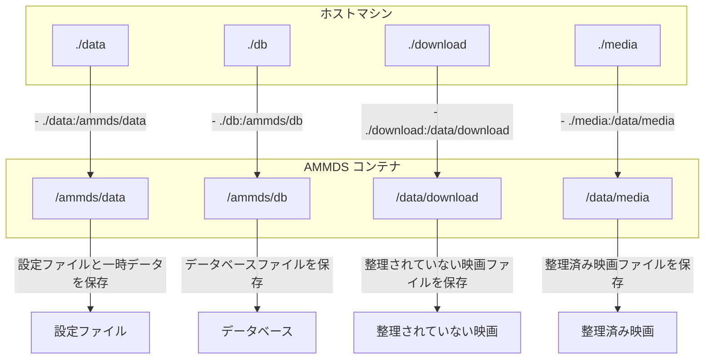
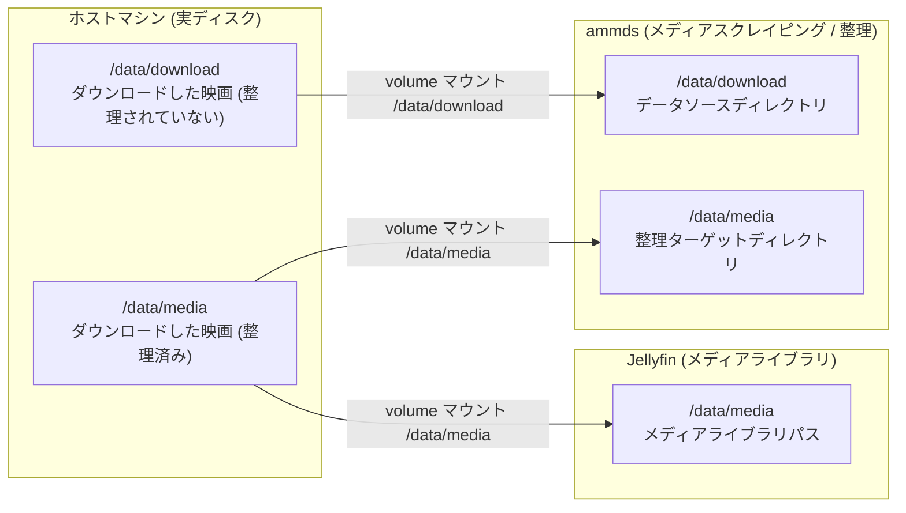
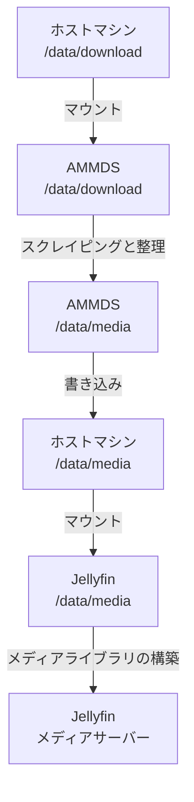
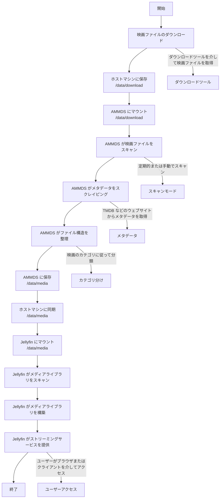
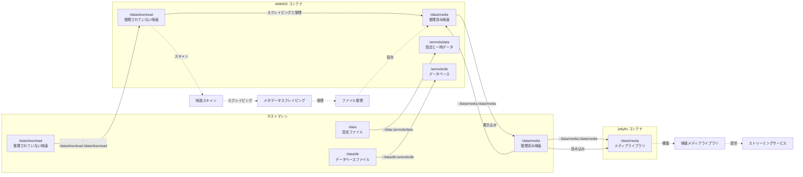

# マウント関係の詳細説明

本ドキュメントでは、AMMDS に関連するマウント関係について詳しく説明します。デプロイ時のマウントロジックとメディア整理のマウントロジックを含み、システム全体のディレクトリ構造とデータフローを理解するのに役立ちます。

:::tip
初めて AMMDS を使用する場合は、システムのマウント関係を理解するためにまずこのドキュメントを読むことをお勧めします。これにより、デプロイと使用中のデータ損失や設定エラーを回避できます。
:::

## 一、デプロイ時のマウントロジック

### 1. 基本マウント設定

Docker Compose を使用して AMMDS をデプロイする場合、`docker-compose.yml` ファイルでマウントディレクトリを設定する必要があります。

```yaml
volumes:
  - ./data:/ammds/data  # 現在のディレクトリの data フォルダをコンテナの /ammds/data にマウント
  - ./db:/ammds/db  # 現在のディレクトリの db フォルダをコンテナの /ammds/db にマウント
  - ./download:/data/download  # 現在のディレクトリの download フォルダをコンテナの /data/download にマウント
  - ./media:/data/media  # 現在のディレクトリの media フォルダをコンテナの /data/media にマウント
```

### 2. ディレクトリの説明

| ホストマシンのディレクトリ | コンテナのディレクトリ | 用途 |
| -------------------------- | ---------------------- | ---- |
| `./data` | `/ammds/data` | AMMDS の設定ファイルと一時データを保存 |
| `./db` | `/ammds/db` | AMMDS のデータベースファイルを保存 |
| `./download` | `/data/download` | 整理されていない映画ファイルを保存 |
| `./media` | `/data/media` | Jellyfin などのメディアサーバーからアクセスするための整理済み映画ファイルを保存 |

### 3. デプロイマウントの図



## 二、メディア整理のマウントロジック

### 1. 全体アーキテクチャ



### 2. ホストマシンと AMMDS の関係

ホストマシンの `/data/download` ディレクトリ（整理されていない映画ファイルを保存）は、Docker ボリュームを介して AMMDS コンテナの `/data/download` ディレクトリにマウントされます。これにより、AMMDS はホストマシン上の整理されていない映画ファイルにアクセスし、スクレイピングと整理操作を実行できます。

具体的には：
- ホストマシン上の `/data/download` ディレクトリは、AMMDS コンテナ内の `/data/download` ディレクトリに対応します
- AMMDS は `/data/download` ディレクトリ内の映画ファイルをスキャンします
- スクレイピングと整理の後、AMMDS は整理済みの映画ファイルを `/data/media` ディレクトリに保存します

:::tip
**なぜこのようにマウントするのですか？**

- AMMDS はスクレイピングと整理のために整理されていない映画ファイルにアクセスする必要があるため、`/data/download` ディレクトリをマウントする必要があります
- AMMDS は整理済みの映画ファイルを Jellyfin からアクセス可能な場所に保存する必要があるため、`/data/media` ディレクトリをマウントする必要があります
- このマウント方法により、AMMDS と Jellyfin が同じメディアライブラリディレクトリを共有でき、データの重複保存を回避できます
- 同じパスを使用することで、ユーザーの混乱を減らし、理解と管理を容易にします
:::

### 3. ホストマシンと Jellyfin の関係

ホストマシンの `/data/media` ディレクトリ（整理済みの映画ファイルを保存）は、Docker ボリュームを介して Jellyfin コンテナの `/data/media` ディレクトリにマウントされます。これにより、Jellyfin は整理済みの映画ファイルにアクセスし、メディアライブラリを構築してストリーミングサービスを提供できます。

具体的には：
- ホストマシン上の `/data/media` ディレクトリは、Jellyfin コンテナ内の `/data/media` ディレクトリに対応します
- Jellyfin は `/data/media` ディレクトリ内の映画ファイルをスキャンします
- ファイル構造とメタデータに基づいて、Jellyfin はメディアライブラリを構築し、分類、検索、再生機能を提供します

:::tip
**なぜ Jellyfin は `/data/media` ディレクトリのみマウントすればよいのですか？**

- メディアサーバーとして、Jellyfin は整理済みの映画ファイルにのみアクセスすればよく、整理されていない映画ファイルにはアクセスする必要がありません
- 整理済みの映画ファイルには、完全なメタデータと標準化されたファイル構造がすでに含まれているため、Jellyfin は直接認識して使用できます
- このマウント方法により、Jellyfin の設定が簡素化され、システムのセキュリティが向上します
:::

### 4. AMMDS と映画ファイルの関係

AMMDS は映画ファイルを処理する際に、次のプロセスを経ます：

1. **スキャンフェーズ**：AMMDS は `/data/download` ディレクトリ内の整理されていない映画ファイルをスキャンします
2. **スクレイピングフェーズ**：ファイル名またはファイル内容に基づいて、AMMDS はインターネットから映画ファイルのメタデータ（タイトル、ポスター、あらすじなど）を取得します
3. **整理フェーズ**：スクレイピングして得たメタデータに基づいて、AMMDS は映画ファイルの名前を変更し、一定のディレクトリ構造に従って `/data/media` ディレクトリに整理します
4. **更新フェーズ**：整理が完了すると、映画ファイルは Jellyfin などのメディアサーバーによって認識され使用されるようになります

### 5. データフロー



### 6. メディア整理プロセス図



### 7. 詳細なディレクトリ構造

#### ホストマシンのディレクトリ構造

```
/data/
├── download/           # 整理されていない映画ファイル
│   ├── movie1.mp4      # 映画ファイル
│   └── ...
└── media/              # 整理済みの映画ファイル
    ├── Movies/         # 映画ディレクトリ
    │   ├── Movie 1 (2023)/
    │   │   ├── Movie 1 (2023).mp4
    │   │   └── poster.jpg
    │   └── ...
    └── ...
```

#### AMMDS コンテナのディレクトリ構造

```
/ammds/
├── data/               # ホストマシンの /data からマップ
│   ├── config.json     # 設定ファイル
│   └── ...
├── db/                 # ホストマシンの /data/db からマップ
│   ├── ammds.db        # データベースファイル
│   └── ...
├── download/           # ホストマシンの /data/download からマップ
│   ├── movie1.mp4
│   └── ...
/media/                  # ホストマシンの /data/media からマップ
├── Movies/
└── ...
```

#### Jellyfin コンテナのディレクトリ構造

```
/data/
└── media/              # ホストマシンの /data/media からマップ
    ├── Movies/
    └── ...
```

## 三、完全なマウント関係図



## 四、よくある質問

### 1. マウントに失敗した場合はどうすればよいですか？

- **パスが正しいか確認**：ホストマシンのディレクトリが存在し、パス形式が正しいことを確認してください
- **権限が十分か確認**：ホストマシンのディレクトリに読み書き権限があることを確認してください
- **Docker サービスが実行中か確認**：Docker サービスが正常に実行されていることを確認してください
- **マウント構文が正しいか確認**：docker-compose.yml のマウント構文が正しいことを確認してください。形式は `- ホストパス:コンテナパス` です

### 2. 整理後の映画ファイルが Jellyfin で表示されない場合はどうすればよいですか？

- **マウントが正しいか確認**：Jellyfin コンテナが `/data/media` ディレクトリを正しくマウントしていることを確認してください
- **メディアライブラリの設定を確認**：Jellyfin に正しいメディアライブラリパスが追加されていることを確認してください
- **メディアライブラリを手動でスキャン**：Jellyfin でメディアライブラリを手動でスキャンし、メディアライブラリの内容を更新してください
- **ファイル権限を確認**：映画ファイルに読み取り権限があることを確認してください

### 3. 整理後の映画ファイルのサイズが変わった場合はどうすればよいですか？

- **圧縮が有効になっていないか確認**：AMMDS はデフォルトで映画ファイルを圧縮しません。他のツールがファイルを圧縮していないか確認してください
- **ファイル形式を確認**：整理プロセス中にファイル形式が変更されていないことを確認してください
- **メタデータサイズを確認**：整理プロセス中にメタデータファイル（nfo ファイル、ポスターなど）が追加されるため、総サイズが増加する場合があります

### 4. マウントされたディレクトリをバックアップするにはどうすればよいですか？

- **定期的なバックアップ**：ホストマシン上の `/data/download` と `/data/media` ディレクトリを定期的にバックアップしてください
- **データベースのバックアップ**：同時に `/data/db` ディレクトリもバックアップして、AMMDS の設定とスクレイピング記録を保存してください
- **バックアップのテスト**：定期的にバックアップが正常に復元できるかテストしてください

:::warning
**重要なお知らせ**

- コンテナが実行中のときにマウントされたディレクトリの権限を直接変更しないでください。コンテナが正常にアクセスできなくなる可能性があります
- 整理されていない映画ファイルを定期的にクリーンアップして、過剰なストレージスペースの占有を避けてください
- ホストマシンに十分なストレージスペースがあることを確認して、スペース不足による整理の失敗を避けてください
:::
