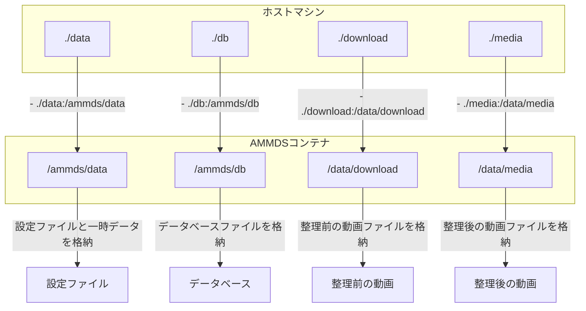
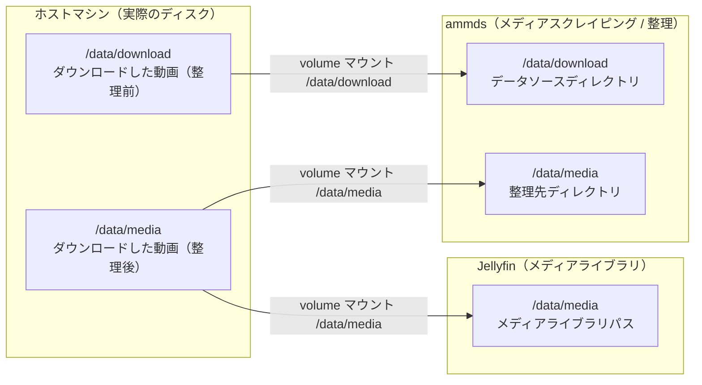
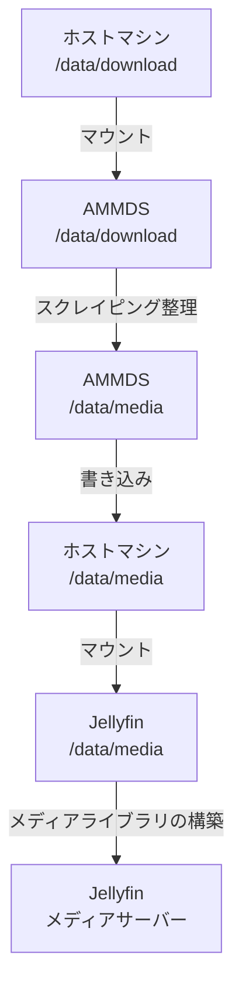
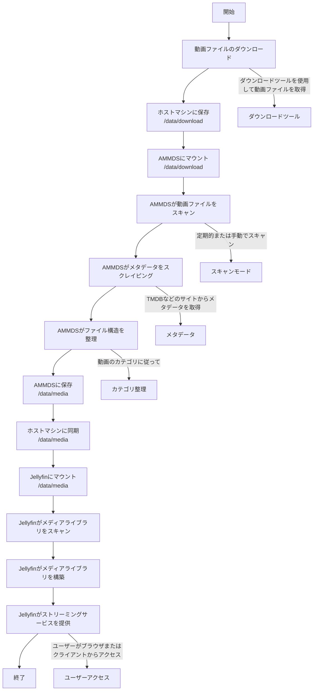
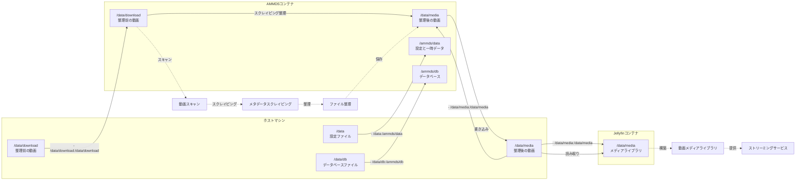

# マウント関係の詳細説明

本ドキュメントでは、AMMDSに関連するマウント関係について詳細に説明します。デプロイ時のマウントロジックとメディア整理のマウントロジックを含め、システム全体のディレクトリ構造とデータフローを理解するのに役立てます。

:::tip
AMMDSを初めて使用する場合は、まず本ドキュメントを読んでシステムのマウント関係を理解することをお勧めします。これにより、デプロイと使用の過程でデータ損失や設定エラーの問題を回避することができます。
:::

## 一、デプロイ時のマウントロジック

### 1. 基本マウント設定

Docker Composeを使用してAMMDSをデプロイする際は、`docker-compose.yml`ファイルでマウントディレクトリを設定する必要があります：

```yaml
volumes:
  - ./data:/ammds/data  # 現在のディレクトリのdataフォルダをコンテナの/ammds/dataにマウント
  - ./db:/ammds/db  # 現在のディレクトリのdbフォルダをコンテナの/ammds/dbにマウント
  - ./download:/data/download  # 現在のディレクトリのdownloadフォルダをコンテナの/data/downloadにマウント
  - ./media:/data/media  # 現在のディレクトリのmediaフォルダをコンテナの/data/mediaにマウント
```

### 2. ディレクトリの説明

| ホストマシンのディレクトリ | コンテナのディレクトリ | 用途 |
| ---------- | -------- | ---- |
| `./data` | `/ammds/data` | AMMDSの設定ファイルと一時データを格納 |
| `./db` | `/ammds/db` | AMMDSのデータベースファイルを格納 |
| `./download` | `/data/download` | ダウンロードした整理前の動画ファイルを格納 |
| `./media` | `/data/media` | 整理後の動画ファイルを格納し、Jellyfinなどのメディアサーバーからアクセス可能にする |

### 3. デプロイマウントの模式図



## 二、メディア整理のマウントロジック

### 1. 全体アーキテクチャ



### 2. ホストマシンとAMMDSの関係

ホストマシンの`/data/download`ディレクトリ（整理前の動画ファイルを格納）は、Docker volumeを介してAMMDSコンテナの`/data/download`ディレクトリにマウントされます。これにより、AMMDSはホストマシン上の整理前の動画ファイルにアクセスし、スクレイピングと整理操作を実行することができます。

具体的には：
- ホストマシン上の`/data/download`ディレクトリは、AMMDSコンテナ内の`/data/download`ディレクトリに対応します
- AMMDSは`/data/download`ディレクトリ内の動画ファイルをスキャンします
- スクレイピングと整理を経て、AMMDSは整理された動画ファイルを`/data/media`ディレクトリに保存します

:::tip
**なぜこのようにマウントするのですか？**

- AMMDSは整理前の動画ファイルにアクセスしてスクレイピングと整理を行う必要があるため、`/data/download`ディレクトリをマウントする必要があります
- AMMDSは整理された動画ファイルをJellyfinからアクセス可能な場所に保存する必要があるため、`/data/media`ディレクトリをマウントする必要があります
- このマウント方法により、AMMDSとJellyfinが同じメディアライブラリディレクトリを共有できるため、データの重複保存が回避されます
- 同じパスを使用することで、ユーザーの混乱が減少し、理解と管理が容易になります
:::

### 3. ホストマシンとJellyfinの関係

ホストマシンの`/data/media`ディレクトリ（整理後の動画ファイルを格納）は、Docker volumeを介してJellyfinコンテナの`/data/media`ディレクトリにマウントされます。これにより、Jellyfinは整理された動画ファイルにアクセスし、メディアライブラリを構築してストリーミングサービスを提供することができます。

具体的には：
- ホストマシン上の`/data/media`ディレクトリは、Jellyfinコンテナ内の`/data/media`ディレクトリに対応します
- Jellyfinは`/data/media`ディレクトリ内の動画ファイルをスキャンします
- ファイル構造とメタデータに基づいて、Jellyfinはメディアライブラリを構築し、分類、検索、再生機能を提供します

:::tip
**なぜJellyfinは`/data/media`ディレクトリのみをマウントすればよいのですか？**

- Jellyfinはメディアサーバーとして、整理された動画ファイルにのみアクセスする必要があり、整理前の動画ファイルにアクセスする必要はありません
- 整理された動画ファイルには、完全なメタデータと標準化されたファイル構造が既に含まれているため、Jellyfinは直接識別して使用することができます
- このマウント方法により、Jellyfinの設定が簡素化され、システムのセキュリティが向上します
:::

### 4. AMMDSと動画ファイルの関係

AMMDSが動画ファイルを処理する際のフローは以下の通りです：

1. **スキャン段階**：AMMDSは`/data/download`ディレクトリ内の整理前の動画ファイルをスキャンします
2. **スクレイピング段階**：ファイル名またはファイル内容に基づいて、AMMDSは動画ファイルのメタデータ（タイトル、ポスター、概要など）をネットワークから取得します
3. **整理段階**：スクレイピングによって取得したメタデータに基づいて、AMMDSは動画ファイルの名前を変更し、一定のディレクトリ構造に従って`/data/media`ディレクトリに整理します
4. **更新段階**：整理が完了すると、動画ファイルはJellyfinなどのメディアサーバーによって識別および使用可能になります

### 5. データフロー



### 6. メディア整理フローの模式図



### 7. 詳細なディレクトリ構造

#### ホストマシンのディレクトリ構造

```
/data/
├── download/           # 整理前の動画ファイル
│   ├── movie1.mp4      # 動画ファイル
│   └── ...
└── media/              # 整理後の動画ファイル
    ├── Movies/         # 動画ディレクトリ
    │   ├── Movie 1 (2023)/
    │   │   ├── Movie 1 (2023).mp4
    │   │   └── poster.jpg
    │   └── ...
    └── ...
```

#### AMMDSコンテナのディレクトリ構造

```
/ammds/
├── data/               # ホストマシンの /data からマップ
│   ├── config.json     # 設定ファイル
│   └── ...
├── db/                 # ホストマシンの /data/db からマップ
│   ├── ammds.db        # データベースファイル
│   └── ...
├── download/           # ホストマシンの /data/download からマップ
│   ├── movie1.mp4
│   └── ...
/media/                  # ホストマシンの /data/media からマップ
├── Movies/
└── ...
```

#### Jellyfinコンテナのディレクトリ構造

```
/data/
└── media/              # ホストマシンの /data/media からマップ
    ├── Movies/
    └── ...
```

## 三、完全なマウント関係の模式図



## 四、よくある質問と回答

### 1. マウントに失敗した場合はどうすればよいですか？

- **パスが正しいか確認する**：ホストマシンのディレクトリが存在し、パスの形式が正しいことを確認してください
- **権限が十分か確認する**：ホストマシンのディレクトリに読み書き権限があることを確認してください
- **Dockerサービスが実行中か確認する**：Dockerサービスが正常に実行されていることを確認してください
- **マウント構文が正しいか確認する**：docker-compose.ymlのマウント構文が正しいことを確認してください。形式は `- ホストマシンのパス:コンテナのパス` です

### 2. 動画ファイルの整理後にJellyfinで表示されない場合はどうすればよいですか？

- **マウントが正しいか確認する**：Jellyfinコンテナが `/data/media` ディレクトリを正しくマウントしていることを確認してください
- **メディアライブラリの設定を確認する**：Jellyfinに正しいメディアライブラリパスが追加されていることを確認してください
- **メディアライブラリを手動でスキャンする**：Jellyfinでメディアライブラリを手動でスキャンし、メディアライブラリの内容を更新してください
- **ファイル権限を確認する**：動画ファイルに読み取り権限があることを確認してください

### 3. 整理後の動画ファイルのサイズが変わった場合はどうすればよいですか？

- **圧縮が有効になっていないか確認する**：AMMDSはデフォルトで動画ファイルを圧縮しません。他のツールがファイルを圧縮していないか確認してください
- **ファイル形式を確認する**：整理プロセス中にファイル形式が変更されていないことを確認してください
- **メタデータのサイズを確認する**：整理プロセス中にメタデータファイル（nfoファイル、ポスターなど）が追加されるため、合計サイズが増加する可能性があります

### 4. マウントされたディレクトリをバックアップするにはどうすればよいですか？

- **定期的にバックアップする**：ホストマシン上の `/data/download` と `/data/media` ディレクトリを定期的にバックアップしてください
- **データベースをバックアップする**：同時に `/data/db` ディレクトリもバックアップして、AMMDSの設定とスクレイピング記録を保存してください
- **バックアップをテストする**：定期的にバックアップが正常に復元できるかどうかをテストしてください

:::warning
**重要な注意事項**

- コンテナの実行中にマウントされたディレクトリの権限を直接変更しないでください。コンテナが正常にアクセスできなくなる可能性があります
- 整理前の動画ファイルを定期的にクリーンアップし、過剰なストレージスペースの消費を避けてください
- ホストマシンに十分なストレージスペースがあることを確認し、スペース不足による整理の失敗を避けてください
:::