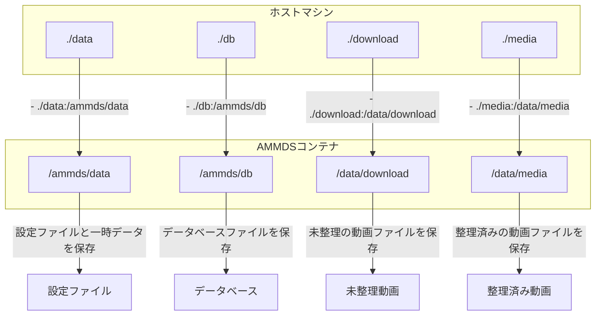
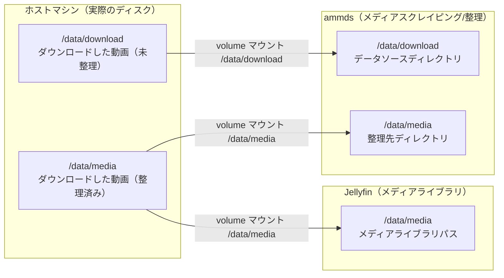

# マウント関係の詳細説明

このドキュメントでは、AMMDS のマウント関係についてわかりやすく説明します。つまり、各フォルダがどのように関連し、データがどのように流れるかです。

:::tip
AMMDS を初めて使う場合は、まずこのドキュメントを読んでマウントの仕組みを理解することをおすすめします。そうすれば、デプロイや使用中にデータを失ったり、設定を間違えたりすることがなくなります。
:::

## 一、デプロイ時のマウントの仕組み

### 1. 基本マウント設定

Docker Compose で AMMDS をデプロイする際は、`docker-compose.yml` ファイルでマウントディレクトリを設定する必要があります：

> **「マウント」って何？** マウントとは、ホストマシン（あなたの PC／サーバー）上のフォルダを、Docker コンテナ（独立した「小箱」）にマッピングして、「小箱」がそのフォルダを読み書きできるようにすることです。USB メモリを PC に挿すと PC が USB メモリのファイルにアクセスできるようになるのと同じです。

```yaml
volumes:
  - ./data:/ammds/data  # 現在のディレクトリの data フォルダをコンテナの /ammds/data にマウント
  - ./db:/ammds/db  # 現在のディレクトリの db フォルダをコンテナの /ammds/db にマウント
  - ./download:/data/download  # 現在のディレクトリの download フォルダをコンテナの /data/download にマウント
  - ./media:/data/media  # 現在のディレクトリの media フォルダをコンテナの /data/media にマウント
```

### 2. ディレクトリの説明

| ホストマシンのディレクトリ | コンテナのディレクトリ | 用途 |
| ---------- | -------- | ---- |
| `./data` | `/ammds/data` | AMMDS の設定ファイルと一時データを保存 |
| `./db` | `/ammds/db` | AMMDS のデータベースファイルを保存 |
| `./download` | `/data/download` | ダウンロードした未整理の動画ファイルを保存 |
| `./media` | `/data/media` | 整理済みの動画ファイルを保存。Jellyfin などのメディアサーバーが使用 |

### 3. デプロイマウントの模式図


```mermaid
flowchart TD
    %% ホストマシンのディレクトリ
    subgraph HOST["ホストマシン"]
        H_DATA["./data"]
        H_DB["./db"]
        H_DOWNLOAD["./download"]
        H_MEDIA["./media"]
    end

    %% AMMDSコンテナ
    subgraph AMMDS["AMMDSコンテナ"]
        A_DATA["/ammds/data"]
        A_DB["/ammds/db"]
        A_DOWNLOAD["/data/download"]
        A_MEDIA["/data/media"]
    end

    %% マウント関係
    H_DATA -->|"- ./data:/ammds/data"| A_DATA
    H_DB -->|"- ./db:/ammds/db"| A_DB
    H_DOWNLOAD -->|"- ./download:/data/download"| A_DOWNLOAD
    H_MEDIA -->|"- ./media:/data/media"| A_MEDIA

    %% 説明
    A_DATA -->|"設定ファイルと一時データを保存"| CONFIG["設定ファイル"]
    A_DB -->|"データベースファイルを保存"| DATABASE["データベース"]
    A_DOWNLOAD -->|"未整理の動画ファイルを保存"| RAW_MEDIA["未整理動画"]
    A_MEDIA -->|"整理済みの動画ファイルを保存"| PROCESSED_MEDIA["整理済み動画"]
```

## 二、メディア整理のマウントの仕組み

### 1. 全体アーキテクチャ


```mermaid
flowchart LR
    %% =========================
    %% ホストマシン（事実のみ保持）
    %% =========================
    subgraph HOST["ホストマシン（実際のディスク）"]
        D1["/data/download<br/>ダウンロードした動画（未整理）"]
        D2["/data/media<br/>ダウンロードした動画（整理済み）"]
    end

    %% =========================
    %% ammds
    %% =========================
    subgraph AMMDS["ammds（メディアスクレイピング/整理）"]
        A1["/data/download<br/>データソースディレクトリ"]
        A2["/data/media<br/>整理先ディレクトリ"]
    end

    %% =========================
    %% jellyfin
    %% =========================
    subgraph JELLYFIN["Jellyfin（メディアライブラリ）"]
        J["/data/media<br/>メディアライブラリパス"]
    end

    %% =========================
    %% マウント関係（必要なもののみ）
    %% =========================
    D1 -->|"volume マウント /data/download"| A1
    D2 -->|"volume マウント /data/media"| A2
    D2 -->|"volume マウント /data/media"| J

```

### 2. ホストマシンと AMMDS の関係

ホストマシンの `/data/download`（未整理の動画を保存）は、Docker のマウント機能により、AMMDS コンテナの `/data/download` にマッピングされます。これにより、AMMDS はホストマシン上の未整理の動画ファイルを参照し、スクレイピングと整理を行うことができます。

簡単に言うと：
- あなたの PC 上の `/data/download` ↔ AMMDS から見える `/data/download`（同じ場所です）
- AMMDS が `/data/download` の動画ファイルをスキャン
- スクレイピング整理後、AMMDS は整理済みの動画を `/data/media` に保存

:::tip
**なぜこのようにマウントするのか？**

- AMMDS は未整理の動画を読み取ってスクレイピング・整理する必要があるため、`/data/download` をマウントする必要があります
- AMMDS が整理した動画は Jellyfin も見える場所に置く必要があるため、`/data/media` をマウントする必要があります
- こうすることで AMMDS と Jellyfin が同じメディアフォルダを共有でき、動画を 2 重にコピーする必要がありません
- パスを統一することで、管理もすっきりします
:::

### 3. ホスト