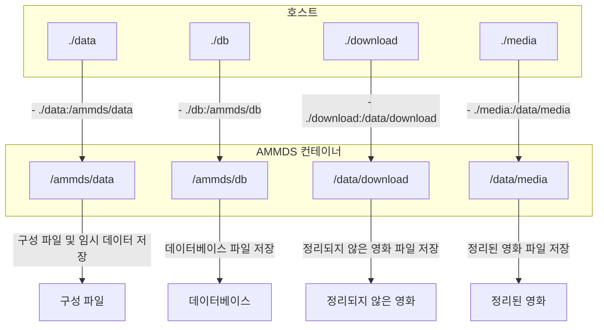
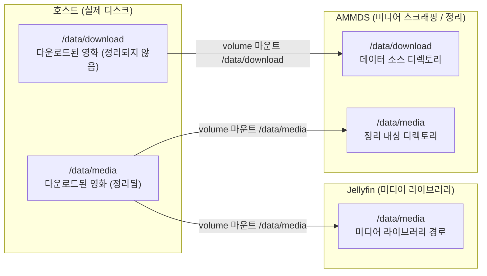
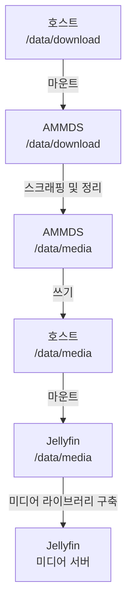
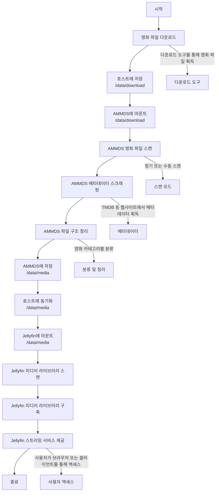
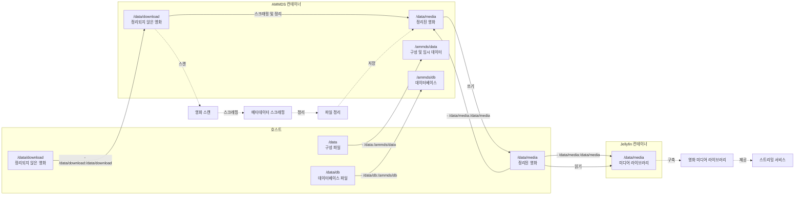

# 마운트 관계 상세 설명

본 문서에서는 AMMDS 관련 마운트 관계를 자세히 설명하며, 배포 시의 마운트 논리와 미디어 정리의 마운트 논리를 포함하여 전체 시스템의 디렉토리 구조와 데이터 흐름을 이해하는 데 도움을 줍니다.

:::tip
첫 번째로 AMMDS를 사용하는 경우, 시스템의 마운트 관계를 이해하기 위해 본 문서를 읽는 것이 좋습니다. 이를 통해 배포 및 사용 과정에서 데이터 손실이나 구성 오류를 방지할 수 있습니다.
:::

## I. 배포 시의 마운트 논리

### 1. 기본 마운트 구성

Docker Compose를 사용하여 AMMDS를 배포할 때 `docker-compose.yml` 파일에서 마운트 디렉토리를 구성해야 합니다:

```yaml
volumes:
  - ./data:/ammds/data  # 현재 디렉토리의 data 폴더를 컨테이너의 /ammds/data에 마운트
  - ./db:/ammds/db  # 현재 디렉토리의 db 폴더를 컨테이너의 /ammds/db에 마운트
  - ./download:/data/download  # 현재 디렉토리의 download 폴더를 컨테이너의 /data/download에 마운트
  - ./media:/data/media  # 현재 디렉토리의 media 폴더를 컨테이너의 /data/media에 마운트
```

### 2. 디렉토리 설명

| 호스트 디렉토리 | 컨테이너 디렉토리 | 용도 |
| ------------- | ------------------ | ------- |
| `./data` | `/ammds/data` | AMMDS 구성 파일 및 임시 데이터 저장 |
| `./db` | `/ammds/db` | AMMDS 데이터베이스 파일 저장 |
| `./download` | `/data/download` | 다운로드된 정리되지 않은 영화 파일 저장 |
| `./media` | `/data/media` | 정리된 영화 파일 저장 (Jellyfin과 같은 미디어 서버에서 액세스 가능) |

### 3. 배포 마운트 다이어그램



## II. 미디어 정리의 마운트 논리

### 1. 전체 아키텍처



### 2. 호스트와 AMMDS의 관계

호스트의 `/data/download` 디렉토리 (정리되지 않은 영화 파일 저장)는 Docker 볼륨을 통해 AMMDS 컨테이너의 `/data/download` 디렉토리에 마운트됩니다. 이를 통해 AMMDS는 호스트의 정리되지 않은 영화 파일에 액세스하여 스크래핑 및 정리 작업을 수행할 수 있습니다.

구체적으로:
- 호스트의 `/data/download` 디렉토리는 AMMDS 컨테이너의 `/data/download` 디렉토리에 해당합니다.
- AMMDS는 `/data/download` 디렉토리의 영화 파일을 스캔합니다.
- 스크래핑 및 정리 후, AMMDS는 정리된 영화 파일을 `/data/media` 디렉토리에 저장합니다.

:::tip
**왜 이렇게 마운트하나요?**

- AMMDS는 스크래핑 및 정리를 위해 정리되지 않은 영화 파일에 액세스해야 하므로 `/data/download` 디렉토리를 마운트해야 합니다.
- AMMDS는 정리된 영화 파일을 Jellyfin이 액세스할 수 있는 위치에 저장해야 하므로 `/data/media` 디렉토리를 마운트해야 합니다.
- 이 마운트 방식은 AMMDS와 Jellyfin이 동일한 미디어 라이브러리 디렉토리를 공유할 수 있도록 하여 데이터 중복 저장을 방지합니다.
- 동일한 경로를 사용하면 사용자의 혼란을 줄이고 시스템을 더 쉽게 이해하고 관리할 수 있습니다.
:::

### 3. 호스트와 Jellyfin의 관계

호스트의 `/data/media` 디렉토리 (정리된 영화 파일 저장)는 Docker 볼륨을 통해 Jellyfin 컨테이너의 `/data/media` 디렉토리에 마운트됩니다. 이를 통해 Jellyfin은 정리된 영화 파일에 액세스하여 미디어 라이브러리를 구축하고 스트리밍 서비스를 제공할 수 있습니다.

구체적으로:
- 호스트의 `/data/media` 디렉토리는 Jellyfin 컨테이너의 `/data/media` 디렉토리에 해당합니다.
- Jellyfin은 `/data/media` 디렉토리의 영화 파일을 스캔합니다.
- 파일 구조와 메타데이터에 따라 Jellyfin은 미디어 라이브러리를 구축하여 분류, 검색 및 재생 기능을 제공합니다.

:::tip
**왜 Jellyfin은 `/data/media` 디렉트리만 마운트하면 되나요?**

- 미디어 서버로서 Jellyfin은 정리된 영화 파일만 액세스하면 되며, 정리되지 않은 파일은 필요하지 않습니다.
- 정리된 영화 파일은 이미 완전한 메타데이터와 표준화된 파일 구조를 포함하고 있어 Jellyfin이 직접 인식하고 사용할 수 있습니다.
- 이 마운트 방식은 Jellyfin 구성을 단순화하고 시스템 보안을 향상시킵니다.
:::

### 4. AMMDS와 영화 파일의 관계

AMMDS가 영화 파일을 처리할 때 다음과 같은 프로세스를 거칩니다:

1. **스캔 단계**: AMMDS는 `/data/download` 디렉토리의 정리되지 않은 영화 파일을 스캔합니다.
2. **스크래핑 단계**: 파일 이름 또는 파일 내용에 따라 AMMDS는 인터넷에서 영화 파일의 메타데이터 (제목, 포스터, 설명 등)를 가져옵니다.
3. **정리 단계**: 스크래핑한 메타데이터에 따라 AMMDS는 영화 파일의 이름을 변경하고 `/data/media` 디렉토리에 일정한 디렉토리 구조로 조직화합니다.
4. **업데이트 단계**: 정리가 완료되면 영화 파일은 Jellyfin과 같은 미디어 서버에서 인식하고 사용할 수 있습니다.

### 5. 데이터 흐름



### 6. 미디어 정리 프로세스 다이어그램



### 7. 상세 디렉토리 구조

#### 호스트 디렉토리 구조

```
/data/
├── download/           # 정리되지 않은 영화 파일
│   ├── movie1.mp4      # 영화 파일
│   └── ...
└── media/              # 정리된 영화 파일
    ├── Movies/         # 영화 디렉토리
    │   ├── Movie 1 (2023)/
    │   │   ├── Movie 1 (2023).mp4
    │   │   └── poster.jpg
    │   └── ...
    └── ...
```

#### AMMDS 컨테이너 디렉토리 구조

```
/ammds/
├── data/               # 호스트의 /data에서 매핑
│   ├── config.json     # 구성 파일
│   └── ...
├── db/                 # 호스트의 /data/db에서 매핑
│   ├── ammds.db        # 데이터베이스 파일
│   └── ...
├── download/           # 호스트의 /data/download에서 매핑
│   ├── movie1.mp4
│   └── ...
/media/                  # 호스트의 /data/media에서 매핑
├── Movies/
└── ...
```

#### Jellyfin 컨테이너 디렉토리 구조

```
/data/
└── media/              # 호스트의 /data/media에서 매핑
    ├── Movies/
    └── ...
```

## III. 완전한 마운트 관계 다이어그램



## IV. 자주 묻는 질문

### 1. 마운트가 실패하면 어떻게 해야 하나요?

- **경로가 올바른지 확인**: 호스트 디렉토리가 존재하고 경로 형식이 올바른지 확인하세요.
- **권한이 충분한지 확인**: 호스트 디렉토리에 읽기 및 쓰기 권한이 있는지 확인하세요.
- **Docker 서비스가 실행 중인지 확인**: Docker 서비스가 정상적으로 실행 중인지 확인하세요.
- **마운트 구문이 올바른지 확인**: docker-compose.yml의 마운트 구문이 `- 호스트 경로:컨테이너 경로` 형식으로 올바른지 확인하세요.

### 2. 정리된 영화 파일이 Jellyfin에서 보이지 않으면 어떻게 해야 하나요?

- **마운트가 올바른지 확인**: Jellyfin 컨테이너가 `/data/media` 디렉토리를 올바르게 마운트했는지 확인하세요.
- **미디어 라이브러리 구성 확인**: Jellyfin에 올바른 미디어 라이브러리 경로를 추가했는지 확인하세요.
- **미디어 라이브러리 수동 스캔**: Jellyfin에서 미디어 라이브러리를 수동으로 스캔하여 미디어 라이브러리 내용을 업데이트하세요.
- **파일 권한 확인**: 영화 파일에 읽기 권한이 있는지 확인하세요.

### 3. 정리된 영화 파일 크기가 변경되면 어떻게 해야 하나요?

- **압축이 활성화되어 있는지 확인**: AMMDS는 기본적으로 영화 파일을 압축하지 않습니다. 다른 도구가 파일을 압축하고 있는지 확인하세요.
- **파일 형식 확인**: 정리 과정에서 파일 형식이 변경되지 않았는지 확인하세요.
- **메타데이터 크기 확인**: 정리 과정에서 메타데이터 파일 (nfo 파일, 포스터 등)이 추가되어 총 크기가 증가할 수 있습니다.

### 4. 마운트된 디렉토리를 백업하는 방법은 무엇인가요?

- **정기 백업**: 호스트의 `/data/download` 및 `/data/media` 디렉토리를 정기적으로 백업하세요.
- **데이터베이스 백업**: AMMDS 구성 및 스크래핑 기록을 저장하기 위해 `/data/db` 디렉토리도 백업하세요.
- **백업 테스트**: 백업이 정상적으로 복원할 수 있는지 정기적으로 테스트하세요.

:::warning
**중요한 경고**

- 컨테이너가 실행 중일 때 마운트된 디렉토리의 권한을 직접 수정하지 마세요. 이로 인해 컨테이너가 정상적으로 액세스할 수 없게 될 수 있습니다.
- 정리되지 않은 영화 파일을 정기적으로 정리하여 너무 많은 저장 공간을 차지하지 않도록 하세요.
- 호스트에 충분한 저장 공간이 있는지 확인하여 공간 부족으로 인한 정리 실패를 방지하세요.
:::