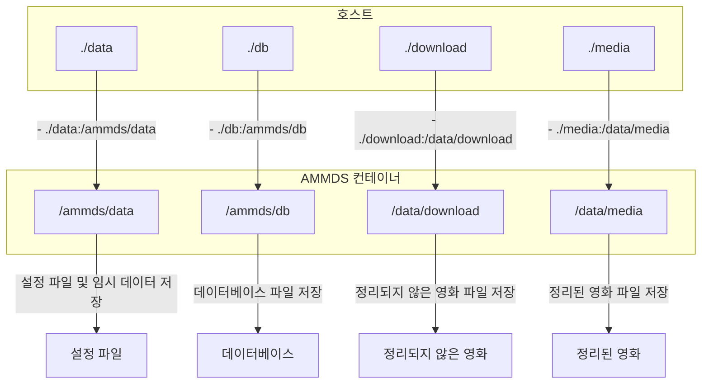
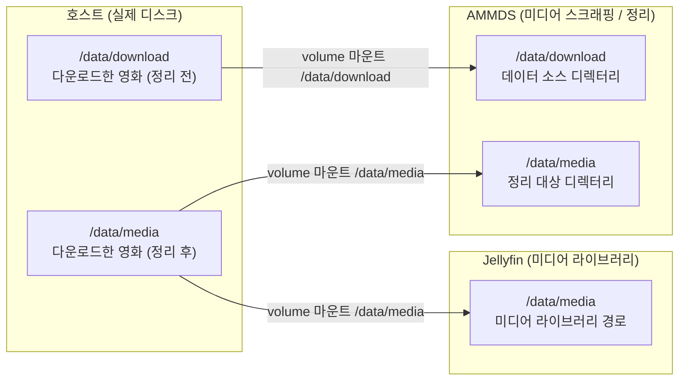
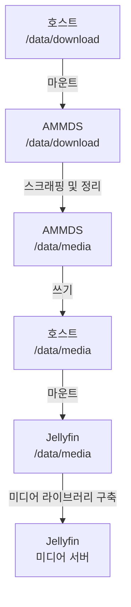
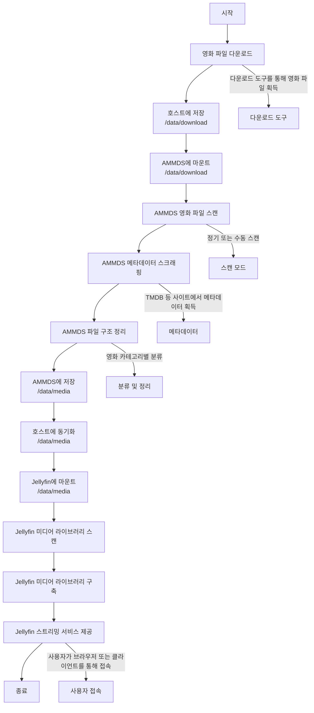
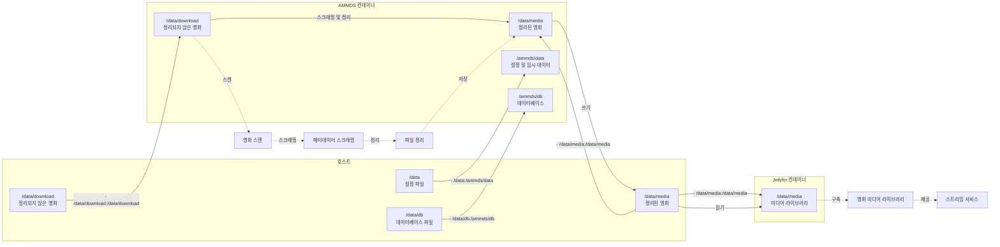

# 마운트 관계 상세 설명

이 문서에서는 AMMDS의 마운트 관계를 쉽게 설명합니다. 즉, 각 폴더가 어떻게 연결되고 데이터가 어떻게 흐르는지 알려드립니다.

:::tip
처음 AMMDS를 사용하는 경우, 이 문서를 먼저 읽고 마운트가 무엇인지 이해하는 것이 좋습니다. 그래야 배포와 사용 중에 데이터를 잃거나 설정을 잘못하는 일이 없습니다.
:::

## 1. 배포 시 마운트 방식

### 1. 기본 마운트 설정

Docker Compose로 AMMDS를 배포할 때 `docker-compose.yml` 파일에 마운트 디렉터리를 설정해야 합니다:

> **"마운트"란?** 호스트(여러분의 컴퓨터/서버)의 폴더를 Docker 컨테이너(독립된 "작은 상자")에 연결하여, 컨테이너가 이 폴더를 읽고 쓸 수 있게 하는 것입니다. USB를 컴퓨터에 꽂으면 컴퓨터가 USB의 파일에 접근할 수 있는 것과 같습니다.

```yaml
volumes:
  - ./data:/ammds/data  # 현재 디렉터리의 data 폴더를 컨테이너의 /ammds/data에 마운트
  - ./db:/ammds/db  # 현재 디렉터리의 db 폴더를 컨테이너의 /ammds/db에 마운트
  - ./download:/data/download  # 현재 디렉터리의 download 폴더를 컨테이너의 /data/download에 마운트
  - ./media:/data/media  # 현재 디렉터리의 media 폴더를 컨테이너의 /data/media에 마운트
```

### 2. 디렉터리 설명

| 호스트 디렉터리(컴퓨터) | 컨테이너 디렉터리(컨테이너 내부) | 용도 |
| ---------- | -------- | ---- |
| `./data` | `/ammds/data` | AMMDS 설정 파일 및 임시 데이터 저장 |
| `./db` | `/ammds/db` | AMMDS 데이터베이스 파일 저장 |
| `./download` | `/data/download` | 다운로드했지만 아직 정리되지 않은 영화 파일 |
| `./media` | `/data/media` | 정리된 영화 파일, Jellyfin 같은 미디어 서버에서 사용 |

### 3. 배포 마운트 다이어그램


```mermaid
flowchart TD
    %% 호스트 디렉터리
    subgraph HOST["호스트"]
        H_DATA["./data"]
        H_DB["./db"]
        H_DOWNLOAD["./download"]
        H_MEDIA["./media"]
    end

    %% AMMDS 컨테이너
    subgraph AMMDS["AMMDS 컨테이너"]
        A_DATA["/ammds/data"]
        A_DB["/ammds/db"]
        A_DOWNLOAD["/data/download"]
        A_MEDIA["/data/media"]
    end

    %% 마운트 관계
    H_DATA -->|"- ./data:/ammds/data"| A_DATA
    H_DB -->|"- ./db:/ammds/db"| A_DB
    H_DOWNLOAD -->|"- ./download:/data/download"| A_DOWNLOAD
    H_MEDIA -->|"- ./media:/data/media"| A_MEDIA

    %% 설명
    A_DATA -->|"설정 파일 및 임시 데이터 저장"| CONFIG["설정 파일"]
    A_DB -->|"데이터베이스 파일 저장"| DATABASE["데이터베이스"]
    A_DOWNLOAD -->|"정리되지 않은 영화 파일 저장"| RAW_MEDIA["정리되지 않은 영화"]
    A_MEDIA -->|"정리된 영화 파일 저장"| PROCESSED_MEDIA["정리된 영화"]
```

## 2. 미디어 정리의 마운트 방식

### 1. 전체 구조


```mermaid
flowchart LR
    %% =========================
    %% 호스트 (실제 디스크)
    %% =========================
    subgraph HOST["호스트 (실제 디스크)"]
        D1["/data/download<br/>다운로드한 영화 (정리 전)"]
        D2["/data/media<br/>다운로드한 영화 (정리 후)"]
    end

    %% =========================
    %% AMMDS
    %% =========================
    subgraph AMMDS["AMMDS (미디어 스크래핑 / 정리)"]
        A1["/data/download<br/>데이터 소스 디렉터리"]
        A2["/data/media<br/>정리 대상 디렉터리"]
    end

    %% =========================
    %% Jellyfin
    %% =========================
    subgraph JELLYFIN["Jellyfin (미디어 라이브러리)"]
        J["/data/media<br/>미디어 라이브러리 경로"]
    end

    %% =========================
    %% 마운트 관계
    %% =========================
    D1 -->|"volume 마운트 /data/download"| A1
    D2 -->|"volume 마운트 /data/media"| A2
    D2 -->|"volume 마운트 /data/media"| J
```

### 2. 호스트와 AMMDS의 관계

호스트의 `/data/download`(정리되지 않은 영화 보관)는 Docker 마운트 기능을 통해 AMMDS 컨테이너의 `/data/download`에 연결됩니다. 이렇게 하면 AMMDS가 호스트에 있는 정리되지 않은 영화 파일을 보고 스크래핑과 정리를 할 수 있습니다.

쉽게 말하면:
- 컴퓨터의 `/data/download` ↔ AMMDS가 보는 `/data/download` (같은 곳)
- AMMDS가 `/data/download`에서 영화 파일을 스캔
- 스크래핑 및 정리 후, AMMDS가 정리된 영화를 `/data/media`에 저장

:::tip
**왜 이렇게 마운트하나요?**

- AMMDS가 정리되지 않은 영화를 읽어야 스크래핑과 정리를 할 수 있으므로 `/data/download`를 마운트해야 함
- AMMDS가 정리한 영화를 Jellyfin도 볼 수 있는 곳에 저장해야 하므로 `/data/media`를 마운트해야 함
- 이렇게 하면 AMMDS와 Jellyfin이 같은 미디어 폴더를 공유할 수 있어 영화를 두 번 복사할 필요가 없음
- 경로가 일관되어 관리하기도 더 깔끔함
:::

### 3. 호스트와 Jellyfin의 관계

호스트의 `/data/media`(정리된 영화 보관)는 Docker 마운트 기능을 통해 Jellyfin 컨테이너의 `/data/media`에 연결됩니다. 이렇게 Jellyfin이 정리된 영화를 읽어 미디어 라이브러리를 구축하고 온라인 시청 서비스를 제공할 수 있습니다.

쉽게 말하면:
- 컴퓨터의 `/data/media` ↔ Jellyfin이 보는 `/data/media` (같은 곳)
- Jellyfin이 `/data/media`에서 영화를 스캔
- 파일 구조와 메타데이터(영화 정보)를 바탕으로 Jellyfin이 미디어 라이브러리를 구축하여 분류, 검색, 재생 기능 제공

:::tip
**Jellyfin은 왜 `/data/media`만 마운트하면 되나요?**

- Jellyfin은 플레이어/미디어 서버로, 정리된 완성품만 보면 됨. 정리되지 않은 원본 파일은 신경 쓸 필요 없음
- 정리된 영화는 이미 완전한 정보와 규칙적인 파일 구조를 갖추고 있어 Jellyfin이 바로 사용할 수 있음
- 이렇게 하면 Jellyfin 설정이 더 간단해지고 보안도 향상됨
:::

### 4. AMMDS와 영화 파일의 관계

AMMDS가 영화 파일을 처리하는 과정은 다음과 같습니다:

1. **스캔 단계**: AMMDS가 `/data/download`에서 정리되지 않은 영화 파일을 찾음
2. **스크래핑 단계**: 파일 이름이나 내용을 바탕으로 인터넷에서 영화 정보(제목, 포스터, 설명 등, 통칭 "메타데이터")를 자동으로 가져옴
3. **정리 단계**: 가져온 정보에 따라 영화 파일 이름을 규칙에 맞게 변경하고, 일정한 디렉터리 구조로 `/data/media`에 저장
4. **업데이트 단계**: 정리完成后 Jellyfin 같은 미디어 서버가 인식하고 사용할 수 있게 됨

### 5. 데이터 흐름


```mermaid
flowchart TD
    %% 데이터 흐름도
    HOST_DOWNLOAD["호스트<br/>/data/download"] -->|"마운트"| AMMDS_DOWNLOAD["AMMDS<br/>/data/download"]
    AMMDS_DOWNLOAD -->|"스크래핑 및 정리"| AMMDS_MEDIA["AMMDS<br/>/data/media"]
    AMMDS_MEDIA -->|"쓰기"| HOST_MEDIA["호스트<br/>/data/media"]
    HOST_MEDIA -->|"마운트"| JELLYFIN_MEDIA["Jellyfin<br/>/data/media"]
    JELLYFIN_MEDIA -->|"미디어 라이브러리 구축"| JELLYFIN_SERVER["Jellyfin<br/>미디어 서버"]
```

### 6. 미디어 정리 프로세스 다이어그램


```mermaid
flowchart TD
    %% 시작
    START["시작"] --> DOWNLOAD["영화 파일 다운로드"]
    
    %% 다운로드 단계
    DOWNLOAD --> SAVE_RAW["호스트에 저장<br/>/data/download"]
    
    %% AMMDS 처리 단계
    SAVE_RAW --> MOUNT_TO_AMMDS["AMMDS에 마운트<br/>/data/download"]
    MOUNT_TO_AMMDS --> SCAN["AMMDS 영화 파일 스캔"]
    SCAN --> SCRAPE["AMMDS 메타데이터 스크래핑"]
    SCRAPE --> ORGANIZE["AMMDS 파일 구조 정리"]
    ORGANIZE --> SAVE_PROCESSED["AMMDS에 저장<br/>/data/media"]
    
    %% 호스트 동기화 단계
    SAVE_PROCESSED --> SYNC_TO_HOST["호스트에 동기화<br/>/data/media"]
    
    %% Jellyfin 처리 단계
    SYNC_TO_HOST --> MOUNT_TO_JELLYFIN["Jellyfin에 마운트<br/>/data/media"]
    MOUNT_TO_JELLYFIN --> JELLYFIN_SCAN["Jellyfin 미디어 라이브러리 스캔"]
    JELLYFIN_SCAN --> BUILD_LIBRARY["Jellyfin 미디어 라이브러리 구축"]
    BUILD_LIBRARY --> PROVIDE_STREAM["Jellyfin 스트리밍 서비스 제공"]
    
    %% 종료
    PROVIDE_STREAM --> END["종료"]
    
    %% 프로세스 설명
    DOWNLOAD -->|"다운로드 도구를 통해 영화 파일 획득"| DOWNLOAD_TOOL["다운로드 도구"]
    SCAN -->|"정기 또는 수동 스캔"| SCAN_MODE["스캔 모드"]
    SCRAPE -->|"TMDB 등 사이트에서 메타데이터 획득"| METADATA["메타데이터"]
    ORGANIZE -->|"영화 카테고리별 분류"| CATEGORIZE["분류 및 정리"]
    PROVIDE_STREAM -->|"사용자가 브라우저 또는 클라이언트를 통해 접속"| USER_ACCESS["사용자 접속"]
```

### 7. 상세 디렉터리 구조

#### 호스트 디렉터리 구조

```
/data/
├── download/           # 정리되지 않은 영화 파일
│   ├── movie1.mp4      # 영화 파일
│   └── ...
└── media/              # 정리된 영화 파일
    ├── Movies/         # 영화 디렉터리
    │   ├── Movie 1 (2023)/
    │   │   ├── Movie 1 (2023).mp4
    │   │   └── poster.jpg
    │   └── ...
    └── ...
```

#### AMMDS 컨테이너 디렉터리 구조

```
/ammds/
├── data/               # 호스트의 /data에서 매핑
│   ├── config.json     # 설정 파일
│   └── ...
├── db/                 # 호스트의 /data/db에서 매핑
│   ├── ammds.db        # 데이터베이스 파일
│   └── ...
├── download/           # 호스트의 /data/download에서 매핑
│   ├── movie1.mp4
│   └── ...
/media/                  # 호스트의 /data/media에서 매핑
├── Movies/
└── ...
```

#### Jellyfin 컨테이너 디렉터리 구조

```
/data/
└── media/              # 호스트의 /data/media에서 매핑
    ├── Movies/
    └── ...
```

## 3. 전체 마운트 관계 다이어그램


```mermaid
flowchart LR
    %% =========================
    %% 호스트
    %% =========================
    subgraph HOST["호스트"]
        H_DOWNLOAD["/data/download<br/>정리되지 않은 영화"]
        H_MEDIA["/data/media<br/>정리된 영화"]
        H_CONFIG["/data<br/>설정 파일"]
        H_DB["/data/db<br/>데이터베이스 파일"]
    end

    %% =========================
    %% AMMDS
    %% =========================
    subgraph AMMDS["AMMDS 컨테이너"]
        A_DATA["/ammds/data<br/>설정 및 임시 데이터"]
        A_DB["/ammds/db<br/>데이터베이스"]
        A_DOWNLOAD["/data/download<br/>정리되지 않은 영화"]
        A_MEDIA["/data/media<br/>정리된 영화"]
    end

    %% =========================
    %% Jellyfin
    %% =========================
    subgraph JELLYFIN["Jellyfin 컨테이너"]
        J_MEDIA["/data/media<br/>미디어 라이브러리"]
    end

    %% =========================
    %% 마운트 관계
    %% =========================
    H_DOWNLOAD -->|"- /data/download:/data/download"| A_DOWNLOAD
    H_MEDIA -->|"- /data/media:/data/media"| A_MEDIA
    H_CONFIG -->|"- /data:/ammds/data"| A_DATA
    H_DB -->|"- /data/db:/ammds/db"| A_DB
    H_MEDIA -->|"- /data/media:/data/media"| J_MEDIA

    %% =========================
    %% 데이터 흐름
    %% =========================
    A_DOWNLOAD -->|"스크래핑 및 정리"| A_MEDIA
    A_MEDIA -->|"쓰기"| H_MEDIA
    H_MEDIA -->|"읽기"| J_MEDIA

    %% =========================
    %% 기능 설명
    %% =========================
    A_DOWNLOAD -.->|"스캔"| SCAN["영화 스캔"]
    SCAN -.->|"스크래핑"| SCRAPE["메타데이터 스크래핑"]
    SCRAPE -.->|"정리"| ORGANIZE["파일 정리"]
    ORGANIZE -.->|"저장"| A_MEDIA
    J_MEDIA -.->|"구축"| LIBRARY["영화 미디어 라이브러리"]
    LIBRARY -.->|"제공"| STREAM["스트리밍 서비스"]
```

## 4. 자주 묻는 질문

### 1. 마운트 실패 시 어떻게 하나요?

- **경로 확인**: 호스트에 해당 폴더가 존재하고 경로가 올바른지 확인
- **권한 확인**: 호스트 폴더에 읽기/쓰기 권한이 있는지 확인
- **Docker 실행 확인**: Docker 서비스가 정상적으로 실행 중인지 확인
- **마운트 문법 확인**: `docker-compose.yml`의 마운트 작성법이 올바른지 확인, 형식은 `- 호스트경로:컨테이너경로`

### 2. 영화 정리 후 Jellyfin에서 안 보여요

- **마운트 확인**: Jellyfin 컨테이너가 `/data/media`를 올바르게 마운트했는지 확인
- **미디어 라이브러리 설정 확인**: Jellyfin에 올바른 미디어 라이브러리 경로가 추가되었는지 확인
- **수동 스캔**: Jellyfin에서 수동으로 스캔하여 새로고침
- **파일 권한 확인**: 영화 파일에 읽기 권한이 있는지 확인

### 3. 정리 후 영화 파일 크기가 변했어요

- **압축 확인**: AMMDS는 기본적으로 영화 파일을 압축하지 않음, 다른 도구가 압축하는지 확인
- **파일 형식 확인**: 정리 과정에서 파일 형식이 변경되지 않았는지 확인
- **메타데이터 파일**: 정리 시 정보 파일(nfo, 포스터 등)이 추가로 생성되어 전체 크기가 증가할 수 있음

### 4. 마운트된 디렉터리 백업 방법

- **정기 백업**: 호스트의 `/data/download`와 `/data/media`를 정기적으로 백업
- **데이터베이스도 백업**: `/data/db`도 함께 백업하여 AMMDS 설정 및 스크래핑 기록 보존
- **복구 테스트**: 백업이 정상적으로 복원되는지 정기적으로 확인

:::warning
**중요 알림**

- 컨테이너 실행 중에는 마운트된 디렉터리의 권한을 직접 변경하지 마세요. 컨테이너가 정상적으로 접근하지 못할 수 있습니다
- 정리되지 않은 영화 파일을 정기적으로 정리하여 너무 많은 디스크 공간을 차지하지 않도록 하세요
- 호스트에 충분한 디스크 공간이 있는지 확인하여 정리 중 공간 부족이 발생하지 않도록 하세요
:::
