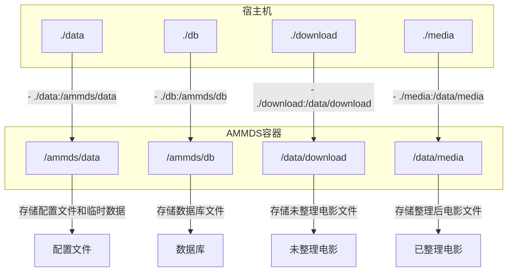
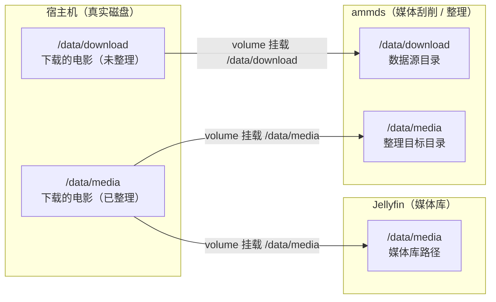
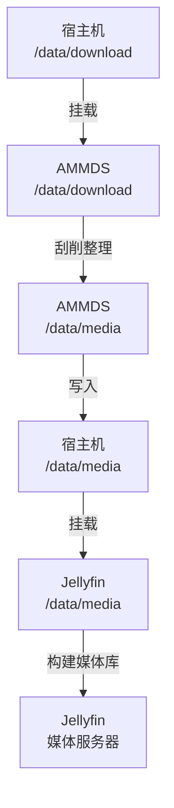
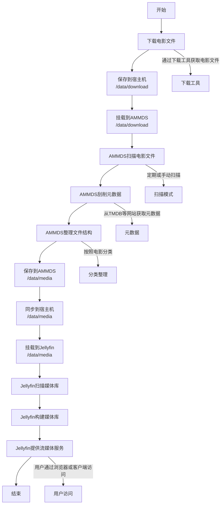
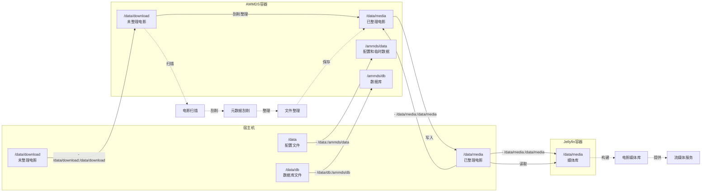

# 挂载关系详解

本文档详细介绍 AMMDS 相关的挂载关系，包括部署时的挂载逻辑和媒体整理的挂载逻辑，帮助您理解整个系统的目录结构和数据流向。

:::tip
如果您是第一次使用 AMMDS，建议您先阅读本文档，了解系统的挂载关系，这样可以避免在部署和使用过程中出现数据丢失或配置错误的问题。
:::

## 一、部署时的挂载逻辑

### 1. 基础挂载配置

在使用 Docker Compose 部署 AMMDS 时，需要在 `docker-compose.yml` 文件中配置挂载目录：

```yaml
volumes:
  - ./data:/ammds/data  # 挂载当前目录的 data 文件夹到容器的 /ammds/data
  - ./db:/ammds/db  # 挂载当前目录的 db 文件夹到容器的 /ammds/db
  - ./download:/data/download  # 挂载当前目录的 download 文件夹到容器的 /data/download
  - ./media:/data/media  # 挂载当前目录的 media 文件夹到容器的 /data/media
```

### 2. 目录说明

| 宿主机目录 | 容器目录 | 用途 |
| ---------- | -------- | ---- |
| `./data` | `/ammds/data` | 存储 AMMDS 的配置文件和临时数据 |
| `./db` | `/ammds/db` | 存储 AMMDS 的数据库文件 |
| `./download` | `/data/download` | 存储下载的未整理电影文件 |
| `./media` | `/data/media` | 存储整理后的电影文件，供 Jellyfin 等媒体服务器访问 |

### 3. 部署挂载示意图



## 二、媒体整理的挂载逻辑

### 1. 整体架构



### 2. 宿主机与AMMDS的关系

宿主机的 `/data/download` 目录（存储未整理的电影文件）通过 Docker volume 挂载到 AMMDS 容器的 `/data/download` 目录。这样，AMMDS 就可以访问到宿主机上的未整理电影文件，进行刮削和整理操作。

具体来说：
- 宿主机上的 `/data/download` 目录对应 AMMDS 容器内的 `/data/download` 目录
- AMMDS 会扫描 `/data/download` 目录中的电影文件
- 经过刮削和整理后，AMMDS 会将整理好的电影文件保存到 `/data/media` 目录

:::tip
**为什么要这样挂载？**

- AMMDS 需要访问未整理的电影文件进行刮削和整理，所以需要挂载 `/data/download` 目录
- AMMDS 需要将整理好的电影文件保存到一个可被 Jellyfin 访问的位置，所以需要挂载 `/data/media` 目录
- 这种挂载方式确保了 AMMDS 和 Jellyfin 可以共享同一个媒体库目录，避免了数据重复存储
- 使用相同的路径可以减少用户的困惑，让用户更容易理解和管理
:::

### 3. 宿主机与Jellyfin的关系

宿主机的 `/data/media` 目录（存储已整理的电影文件）通过 Docker volume 挂载到 Jellyfin 容器的 `/data/media` 目录。这样，Jellyfin 就可以访问到整理好的电影文件，构建媒体库并提供流媒体服务。

具体来说：
- 宿主机上的 `/data/media` 目录对应 Jellyfin 容器内的 `/data/media` 目录
- Jellyfin 会扫描 `/data/media` 目录中的电影文件
- 根据文件结构和元数据，Jellyfin 会构建媒体库，提供分类、搜索和播放功能

:::tip
**为什么Jellyfin只需要挂载 `/data/media` 目录？**

- Jellyfin 作为媒体服务器，只需要访问整理好的电影文件，不需要访问未整理的电影文件
- 整理好的电影文件已经包含了完整的元数据和规范的文件结构，Jellyfin 可以直接识别和使用
- 这种挂载方式简化了 Jellyfin 的配置，提高了系统的安全性
:::

### 4. AMMDS与电影文件的关系

AMMDS 在处理电影文件时，会经历以下流程：

1. **扫描阶段**：AMMDS 扫描 `/data/download` 目录中的未整理电影文件
2. **刮削阶段**：根据文件名或文件内容，AMMDS 从网络上获取电影文件的元数据（如标题、海报、简介等）
3. **整理阶段**：根据刮削得到的元数据，AMMDS 会将电影文件重命名并按照一定的目录结构组织到 `/data/media` 目录
4. **更新阶段**：整理完成后，电影文件就可以被 Jellyfin 等媒体服务器识别和使用

### 5. 数据流向



### 6. 媒体整理流程示意图



### 7. 详细目录结构

#### 宿主机目录结构

```
/data/
├── download/           # 未整理的电影文件
│   ├── movie1.mp4      # 电影文件
│   └── ...
└── media/              # 已整理的电影文件
    ├── Movies/         # 电影目录
    │   ├── Movie 1 (2023)/
    │   │   ├── Movie 1 (2023).mp4
    │   │   └── poster.jpg
    │   └── ...
    └── ...
```

#### AMMDS容器目录结构

```
/ammds/
├── data/               # 映射自宿主机的 /data
│   ├── config.json     # 配置文件
│   └── ...
├── db/                 # 映射自宿主机的 /data/db
│   ├── ammds.db        # 数据库文件
│   └── ...
├── download/           # 映射自宿主机的 /data/download
│   ├── movie1.mp4
│   └── ...
/media/                  # 映射自宿主机的 /data/media
├── Movies/
└── ...
```

#### Jellyfin容器目录结构

```
/data/
└── media/              # 映射自宿主机的 /data/media
    ├── Movies/
    └── ...
```

## 三、完整挂载关系示意图



## 四、常见问题解答

### 1. 挂载失败怎么办？

- **检查路径是否正确**：确保宿主机目录存在，路径格式正确
- **检查权限是否足够**：确保宿主机目录有读写权限
- **检查Docker服务是否运行**：确保Docker服务正常运行
- **检查挂载语法是否正确**：确保docker-compose.yml中的挂载语法正确，格式为 `- 宿主机路径:容器路径`

### 2. 电影文件整理后在Jellyfin中看不到怎么办？

- **检查挂载是否正确**：确保Jellyfin容器正确挂载了 `/data/media` 目录
- **检查媒体库配置**：确保Jellyfin中添加了正确的媒体库路径
- **手动扫描媒体库**：在Jellyfin中手动扫描媒体库，更新媒体库内容
- **检查文件权限**：确保电影文件有可读权限

### 3. 整理后的电影文件大小变了怎么办？

- **检查是否开启了压缩**：AMMDS默认不会压缩电影文件，检查是否有其他工具在压缩文件
- **检查文件格式**：确保整理过程中没有改变文件格式
- **检查元数据大小**：整理过程中会添加元数据文件（如nfo文件、海报等），这会增加总大小

### 4. 如何备份挂载的目录？

- **定期备份**：定期备份宿主机上的 `/data/download` 和 `/data/media` 目录
- **备份数据库**：同时备份 `/data/db` 目录，以保存AMMDS的配置和刮削记录
- **测试备份**：定期测试备份是否可以正常恢复

:::warning
**重要提醒**

- 不要在容器运行时直接修改挂载目录的权限，可能会导致容器无法正常访问
- 定期清理未整理的电影文件，避免占用过多存储空间
- 确保宿主机有足够的存储空间，避免因空间不足导致整理失败
:::